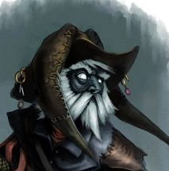

# Droki

[Home](../../README.md) > [Characters](../info.md) > Droki

Droki is a male derro first encountered in the city of Gracklstugh. Droki has connections with the Gray Ghosts of the underdark and acts a courier of goods for them, and as such is wanted by the authorities of Gracklstugh.

## Personality

Droki has quite an eccentric personality, seen both through his actions and his possessions. Droki speaks very quickly and acts constantly as if he is in distress and needs to move quickly. He is fidgety and quite unnerved, making it difficult to get useful information from him in important times. He tends to ramble about superfluous details when asked questions, making him unreliable as an informat for most situations. Nevertheless, his speed and tenacity make him a good candidate for smuggling, which is what the Gray Ghosts use him for.

## Background

At some point in the past, Droki caught the attention of the Stone Guard of Gracklstugh and became a wanted man. It is unknown if Droki was the reason that the Stone Guard became aware of surface smuggling or if he simply became the center of attention as the one traveling through the city. Other than this not much is known about Droki's background.

## Story
### [The City of Blades](../../sessions/arc04/info.md)

Droki was first seen by [Ebadius](../pcs/ebadius.md) in Gracklstugh while Droki was performing various tasks throughout the city. Ebadius was able to catch Droki in pursuit while he tried to flee into the West Cleft District of the city. Ebadius took Droki back to the party, who was conversing about their next steps outside of Themberchaud's Lair. The party searched his belongings while Ebadius translated his speech. Droki admits that he is to deliver goods to the Gray Ghosts, as well as "the chanters", but does not elaborate. [Eldeth](../party/eldeth.md) suggests delivering Droki to the authorities, but the rest of the party votes to follow him into the Whorlstone Tunnels to see his delivery route.

Droki led the party into the Cleft District and into the Whorlstone tunnels. While demonstrating the crack in the wall that he passes through, Droki ate a mushroom that shrank his size and escapes. The party then lost track as they tried to find the correct mushroom to chase after him.

Droki eventually found his way back to the party my mistake, still shrunk. [Alias](../pcs/alias.md), on watch, caught Droki and tied him up without waking the others. When the mushroom wore off, Droki returned to normal size and was crushed under the restraints that Alias placed on him. [Groggle](../pcs/groggle.md) was awoken to heal him, and this event left Droki in enough of a state of shock that he began following the party's instructions.

Droki was ordered to lead the party on the route that he took so they could find the Gray Ghosts. Droki led the party through several chambers and to a room containing a group of Gay Ghosts. After a failed encounter with this group, the party moved on. Droki alerted the party to the "water thing" in the nearby lake and to be careful.

## Relationships

Droki has not established many strong relationships with anyone thus far. He is fearful of the party, due to the fact that they have captured him twice now and on one occassion actually caused him extreme physical harm.

## Trivia
* Droki seems oddly obsessed with his hat. He has described it as "one of a kind", but has said nothing else of the matter.
