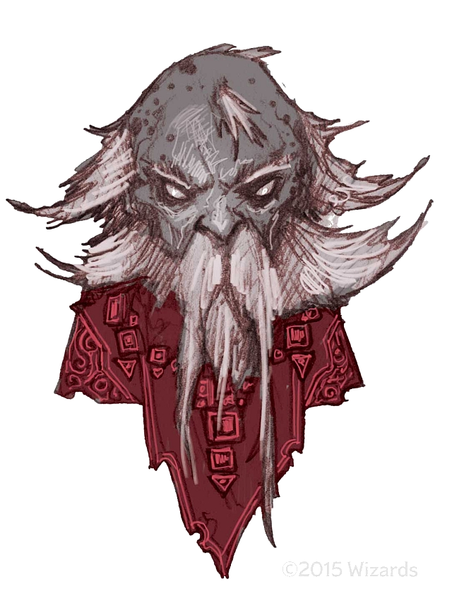

# Buppido

Buppido is a male derro, first encountered in Velkenvelve and last seen leaving after Demogorgon's arrival in Sloobludop.

## Personality
Buppido is a blunt, talkative, and a bit rough around the edges. He has no fear as to what others will think of what he is saying and has no issue calling out what he thinks should or shouldn't be done. He often makes others uncomfortable, either because of the things that he says or simply the tone that he chooses to take with his speech.

Buppido, in general, does not seek to make friends. With that, Buppido has not established any particularly close ties with any of the party members, also not expressing any remorse or sorrow for any ill effects on the party members. He has expressed on several occasions that bad things will always happen and there is often little or nothing that can be done about it. Even when ill fate befalls him, such as becoming injured or being threatened, Buppido does not seem to react strongly. When discussing [Jimjar](jimjar.md)'s death with [Alias](../pcs/alias.md), he acted as if his death was simply unavoidable and that this was the way of the underdark.

Many of the party members describe Buppido as shifty and suspicious. In fact, his personality was one of the primary reasons that the party suspected him as Jimjar's killer.

## Background
Buppido comes from Gracklstugh and mentioned that he has performed a variety of odd jobs while he was there. He implied to both Alias and [Ebadius](../pcs/ebadius.md) that he had done some less than safe or legal jobs there and he did whatever he needed to in order to survive. Buppido is not particularly secretive about his past, but does not divulge information unless directly pressed on the matter. Beyond this, not much is known about his background.

## Story
### [The Prison at Velkenvelve](../../sessions/arc01/info.md)
Buppido arrived in Velkenvelve in the second batch of prisoners, together with Alias and [Dad](../pcs/dad.md) and after Ebadius, [Groggle](../pcs/groggle.md) and [Sarith](sarith.md). Buppido introduced himself and had no issue putting his personality forward. He originally seemed like a useful party member due to his knowledge of the underdark and his arrogant attitude that implied that he was not worried.

Buppido was placed on kitchen duty together with Ebadius and Dad when Dad attempted to grab a knife to fight the drow. Once combat began, Buppido did not intervene, and instead watched the commotion unfold. When Ilvara stepped in to stop the combat, a guard smashed Buppido's head against the wall, knocking him unconscious. While unconscious, he was taken back to the cell with Ebadius.

After waking up, Buppido was introduced to the new prisoners Jimjar and [Eldeth](eldeth.md). Buppido offered little in the way of aid in an escape plan and seemed more interested in having his party members determine a plan while he followed behind.

Buppido was placed on duty for cleaning the mess hall with [Ront](ront.md) and [Derendil](derendil.md) when Sarith began the riot in Velkenvelve. Buppido stepped out to see what was happening, but did not intervene on either side. As Dad, Eldeth, Ront, and Derendil started fighting, a nearby drow shoved Buppido into the webs beneath in order to join the fight. He got stuck in the webs and was eventually extracted with the aid of Alias, and together with Ebadius they made their way to the elevator where Dad rescued them.

After escaping, Buppido voted to travel to Gracklstugh, as it is his home.

### [Travel to Sloobludop](../../sessions/arc02/info.md)
After leaving Velkenvelve, Buppido stayed in the middle of the pack during travel. He had little to say before the party arrived at the lost city of Alversin, where he then participated in foraging for supplies within the city. After spending a bit of time in the city, Buppido was one of the few party members that wanted to move on, together with Sarith and Jimjar.

In the attack on the goblins, Buppido stayed in the back and let the others fight. When the drow arrived and found the party, Buppido almost spoke up before he was silenced by Alias. Buppido was spotted by the drow before Groggle casts *suggestion* and they escaped into the tunnnels.

When Jimjar was found dead, Buppido did not appear surprised, nor did he seem to care too much. During Alias' questions, he seemed confident that nothing would come of it. When discussing the implications with other party members, he stated that he wasn't surprised that someone was killed and that it was simply the will of the gods, or something similar. 

Buppido went with Alias, Ebadius, and Groggle to investigate the voices that they heard in the tunnels, but were unable to find the source.

Buppido was mostly silent for most of the travel to Sloobludop from there. He did aid in searching for food after the fight with the grell together with Eldeth.

When asked by Plooplooppeen if the party would aid him in their schism with the cult of the Deep Father, Buppido seemed off put, but obliged. In Sloobludop, he took a walk in the night, where he was followed by Alias, who did not trust him. During the day, he seemed to disappear and no one is aware of where he went or what he was doing.

After Demogorgon rose from the water, Buppido seemed unphased by the event, at least in terms of how it affected his sanity. He walked away from the altar while the kuo-toa chanted for their god and was never seen again.

## Relationships
Buppido had no strong relationships with any of the party members for several reasons, the primary one being his gruff, blunt, and distant demeanor. The only party members that would actively engage him in conversation were Alias, Ebadius, and [Shuushar](shuushar.md); Alias and Ebadius were interested in what he was capable of as a person while Shuushar was interested in getting to know him personally. Most characters felt generally uncomfortable being around him, but as a whole none felt so uncomfortable around him as to refuse working with him.

His strained relationship with others made the party treat him as a wildcard, not being able to predict what he would do or why. In fact, some characters resented him for being the reason they either got in trouble or why trouble was made worse, often by his antagonism or his ineffectiveness in combat or diplomacy. From what others could tell, his intentions were less to cause trouble than they were negligence, and so his lack of will to do harm seemed to keep others on his side, even if they didn't like him much.

## Trivia
* It appeared that Ebadius would befriend Buppido in Velkenvelve initially, but after Buppido strangely reacted to the riot in the mess hall his thoughts seemed to change.
* In regards to Jimjar's murder, most of the party suspected Buppido as the killer. That being said, most of the player characters remained unsure and actually suspected each other.
* Several party members tried to lie to Buppido on several occasions and failed. It appeared that he was very skilled at spotting truth and lies.
