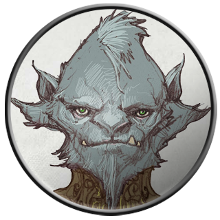

# Derendil

Derendil was a male quaggoth encountered as a prisoner of Velkenvelve.

## Personality
Derendil was very polite, much to the surprise of the other party members, due to the nature of quaggoths. He spoke regally, has his background would imply, and made a good impression on those he communicated with. He first spoke with [Alias](../pcs/alias.md), who spoke a bit about his past and how he arrived at Velkenvelve. 

## Background
Of the history that he gave, Derendil is a prince of Nelrindenvane. Although unclear how it happened, Derendil was polymorphed into a quaggoth by a wizard in his kingdom and thrown into the underdark to survive before he was captured by drow and brought to Velkenvelve. The rest of his background remains a mystery.

## Story
### [Welcome to Velkenvelve](../../sessions/arc01/info.md)
Derendil arrived at Velkenvelve together with [Ront](ront.md). He spoke with Alias about his history as a prince and offered a great reward to those who helped him escape. He mentioned that he was an elven prince that had been polymorphed into a quaggoth, much to his dismay. He enforced that he would also use his massive size and strength to help the party in an escape.

Derendil was eventually placed on a cleaning shift with [Buppido](buppido.md) and Ront. After [Sarith](sarith.md) threw a rock and started the riot for the escape, Derendil emerged from the mess hall to see what was happening. When he saw [Dad](../pcs/dad.md) and [Eldeth](eldeth.md) beginning to fight the guards, Derendil swiftly joined in and began attacking the guards near him. While the party made their escape, Derendil stayed in the central area of Velkenvelve and continued fighting both drow and quaggoths alike.

## Death and Legacy
Derendil died fighting the drow guards during the escape from Velkenvelve. He was seen by some of the party members (such as Dad) fighting the drow until he inevitably fell to their numbers. It was unclear how many of the guards he had successfully killed or fended off, as he was mostly left alone to defend the escape. The party's escape would not have been possible if it hadn't been for Derendil's defense of their escape route.

## Relationships
Derendil did not have enough time to establish strong relationships with the rest of the party, due to his short time in Velkenvelve. He had a good relationship with Alias, since she was the only other person in the prison that spoke his language. In general, he was able to be friends with the others simply due to the fact that he wanted to escape and had the means (his strength) to do so.

## Trivia
* Derendil is the primary reason that many of the party members did not need to confront the drow during their escape of Velkenvelve, since he held off most of the guards. Since he died during the fight, he was a sacrifice that allowed them to escape, but many of the party members usually forget his sacrifice.
