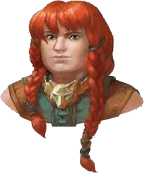

# Eldeth Feldrun

Eldeth Feldrun is a female dwarf from Gauntlgrym who found her way into the underdark. She was first encountered in Velkenvelve and has remained with the party every since.

## Personality
Eldeth is known amongst the party as being one of the more level-headed members, offering useful advice while remaining cautious as necessary. While she has not stood out as a primary leader, her calm demeaner does make her someone that others turn to for her input before a decision is made. On more than one occasion, the primary leaders of [Alias](../pcs/alias.md) and [Ebadius](../pcs/ebadius.md) have stopped discussion to ask Eldeth what she thinks. While she has suffered from the ill effects of madness on more than one occasion, she has remained a useful ally o the party.

Eldeth also has a strong will to fight when things get tough. She has often been toward the front of the party when combat begins and aids in leading the party when fighting is required. This trait of hers has also caused other party members to turn to her on several occasions, even causing her to bond with some of the more brutish party members like [Dad](../pcs/dad.md) and [Ront](ront.md).

Her most difficult trait is her flagrant racism towards the creatures of the underdark. She has referred to several underdark races as "darkies" and has made a few party members anrgy with her as a result. She had a difficult time trusting certain members such as [Sarith](sarith.md), especially after he exhibited his bouts of madness, and she especially did not trust [Buppido](buppido.md) when we was around. She has always stuck close to the surface dwwellers in the party, having more in common with them and harboring no resentment either.

## Background
Eldeth comes from the city of Gauntlgrym, and is the daughter of a noble of the city. She was raised as a traditional daughter of nobility and knows a lot of information regarding overworld history, politics, and kingdoms. She also has skills to reflect this upbringing, as well as combat skills demonstrated from being raised in a traditional dwarven household. This background has made Eldeth both a competent fighter as well as a value asset in decision making.

Little else is known about her history, as she doesn't much talk about the details.

## Story
### [The Prison at Velkenvelve](../../sessions/arc01/info.md)

Eldeth arrived in Velkenvelve alongside [Jimjar](jimjar.md) while the prisoners were performing their daily tasks. After the prisoners started their first commotion, Ebadius was returned to the cell and was the first to introduce himself to Eldeth. When the others returned from the commotion, Eldeth introduced herself to everyone, and most of the party quickly attached themselves to her since she seemed dependable. She did instill a bit of worry when she discussed the creatures of the underdark with disdain, but others mostly looked past these comments considering their situation. She infored the party of her valuables that were taken when she was detained and asked people to look for them if something were to happen to her, namely her hammer and her armor.

Eldeth was on duty with Dad and Sarith when Sarith threw a rock at a guard and Dad started a riot. Eldeth joined in the conflict to hold of the guards when [Derendil](derendil.md) and Ront joined the fight as well. Together, Eldeth was able to escape through the elevator with Dad and Ront before much else evolved. Eldeth waited for the party to arrive slowly and was unaware of the commotion of the mosters that had attacked at the same time. There, Alias returned her hammer to her, but her armor remained unrecovered.

When voting on where to travel next, Eldeth voted to travel to Sloobludop, thinking that it was best to find a safe haven and resupply themselves before seeking a way out of the underdark. She also trusted that [Shuushar](shuushar.md) would be able to navigate them there safely and could also navigate the darklake once there if needed.

### [Travel to Sloobludop](../../sessions/arc02/info.md)

Eldeth was placed mostly toward the front of the party due to ability in combat after leaving Velkenvelve.

As the party approached the large cavern with the lost city of Alversin, Eldeth began to fall into the early stages of madness after hearing the voices whispering around them. She was eventually calmed down by Alias and was able to keep moving, although shaken up. Within the city, she stayed close with Alias and Stool during their search, where she bonded more with Alias. She was placed on watch with Alias as well. The next day she accompanied Alias around the city to invesitage the person Ebadius saw as well as to search for more supplies with Alias and Stool. They waited at the exit of the city for Ebadius, [Groggle](../pcs/groggle.md), and Shuushar to finish their search before leaving.

In the battle against the goblins, Eldeth stayed out of the conflict, and was a bit surprised by the behavior of the party. Alias informed her that she did not mean to cause such trouble.

On watch that night, Alias and Eldeth identified the sounds of the approaching drow soldiers. They ran behind a stalgmite and attempted to distract the scouts as they approached and failed, but managed to escape after Groggle led the party out.

On her next watch, Eldeth found Jimjar dead amongst the party members and immedietely roused everyone for questioning. She explained that she returned from watch with Alias and found Jimjar's body stabbed to death. She was unable to pull any information from the party and slept with her hammer in her hands.

In the fight with gas spores, Eldeth held the front line without going deep into the cloud of spores, sparing her from their effects. Later that night on watch, she discusses the party's next steps with Alias, worried that they will not escape the underdark alive.

When Sarith woke up screaming, Eldeth aided Dad in holding him down and tying him up. To the distaste of others, she suggested that they get rid of him before he became a danger to the others, but was ignored in favor of keeping him alive. The following night, she went without food, as the party had little to eat.

Eldeth stayed back when Shuushar moved to parlay with the kuo-toa, but was retrieved by Ebadius when things went south. She joined as the fighting ended and joined the others in choosing to aid the kuo-toa in support of the Sea Mother. In town, Eldeth mostly kept to herself and stayed within the inn while some of the others explored the town. She eventually joined up with Alias as the two of them investigated the rooms of their party members in order to learn if one of them was Jimjar's murderer, but found nothing. Eventually, Eldeth was left to rest and explore on her own.

When [Demogorgon](../../lore/demon_lords/demogorgon.md) rose from the darklake, Edleth was frozen in fear, overtaken by the beginning effects of madness. She was brought back to her sense by Shuushar, where she then proceeded to shake Dad back to reality as well. She escaped the altar together with Dad before meeting up wiith Sarith outside of Sloobludop.

### [Dangers of the Darklake](../../sessions/arc03/info.md)

After escaping Sloobludop, Eldeth went to look for food with Alias and Ebadius. She eventually returned to camp to wait with [Hemeth](hemeth.md) until Dad and Sarith arrived an explained they were being chased. After Ront returned, they all traveled to Sloobludop to warn the rest of the party. 

On the boat to Gracklstugh, Eldeth had a difficult conversation with Alias where she said that she is not interested romantically with Alias.

Eldeth aided in fighting off the darkmantles from attacking the party, where she was injured. When the party docked for supplies, she remained behind with Ebadius, Shuushar, and Ront. Afte returning to the darklake, Alias confided in Eldeth regarding her fears of the tunnels and what happened to her. Eldeth supported Alias by stating that they will get out safely and she will help keep everyone safe.

While attacking the duergar traders, Eldeth didn't participate in combat, instead questioning why the party waas threatening and fighting the traders in the first place.

After docking again, Eldeth stayed behing with Groggle, Shuushar, Ront, and Hemeth, until Sarith returned and sent Groggle to help.

When the party sent Shuushar to explore the fungus island, Eldeth moved with Alias, Dad, Ebadius, and Groggle in an attempt to rescue him. Once Ebadius cat _thaumaturgy_ and the island began retaliating, Eldeth immedietely returned to the boat, together with Shuushar and Groggle, and waited for the others to arrive. After the conflict with Hemeth as captain, Eldeth voted to overthrow Hemeth. She voted for Groggle as the captain and for Shuushar as the first mate.

As the party docked in the crystal caverns, Eldeth remained behind with Hemeth and Shuushar. When Groggle returned to explain the situation, Eldeth returned to the crystal cavern with him to gather crystals. As they heard people approaching, they hid behind the crystals to avoid them, learning that they were a traveling group of drow. They then returned to be boat to leave, and finally left once Dad, Ebadius, Ront, and Sarith arrived.

### [The City of Blades](../../sessions/arc04/info.md)

When the party arrived to Gracklstugh, Eldeth remained on the boat while Alias moved to scout ahead. She and Shuushar noticed the crossbow bolts firing from the wall and encouraged the party to return to grab Alias. She also did nothing to fight Groggle's idea of giving Hemeth the boat in exchange for docking instructions. She then followed in line with the others to Gholbrorn's Lair, following Shuushar and ahead of Sarith. After arriving, she stayed behind to relax while others began exploring the city.

Eldeth helped defeat the rampaging giant in the Blade Bazaar of Gracklstugh, dealing the most damage as a whole. She also acted as the primary translator between the duergar guards as well as the other party members. After, she returned with the party to the inn to discuss what they expect would happen next.

The following day, Eldeth and Alias went to speak with the giants outside the gates, but are refused access to the rest of the city. They then met up with Ebadius and Groggle and traveled to Overlake Hold to get passes for travel within the city, where they were then held by Errde Blackskull and Gartokkar Xundorn. Eldeth remained mostly quiet until Groggle caved and explained the situation, to which she agreed with the decision to work for their freedom. She was sent away with Gartokkar and Ront to the Keepers of the Flame's headquarters in Themberchaud's Lair.

After receiving her instructions, Eldeth left Themberchaud's Lair and split from Ront and Dad to speak with the giants. She met back up after some time with Alias, Dad, Ebadius, and Groggle outside of Themberchaud's Lair while the party was looking to defect to the Keeper's of the Flamse. Eldeth showed the party a large crystal given to her as a gift from the giants, which was immedietely taken by Themberchaud once presented to him.

## Relationships

Very few party members hold a negative opinion of Eldeth, primarily owing to her reasonable disposition and care to listen to the opinions of others. She has an exceptionally strong relationship with Alias, who, while originally trying to start a romantic relationship, showed her the most attention and respect. The two of them often travel alone together to perform tasks while the others are busy, and often are left on watch together. She has also developed a good relationship with Ebadius and Groggle, both of which consult her with many of their endeavors. She even surprisingly is able to converse with Dad and Ront, both of which form rifts between themselves and other members of the party.

While her relationship is not particularly bad with Shuushar, she often does not consider his thoughts regarding events. While he has not done anything to harm her, it would seem that her dislike of underdark creatures extends even to Shuushar. This universal distrust of underdark creatures makes her ver distrustful of Sarith, enough to even say at one point that he should be left behind. When Buppido was in the party, Eldeth voiced many concerns to Alias about her distrust of him, which may have also partly been due to her racism.

## Trivia
* Eldeth was a love interest of Alias for a long time before Eldeth had to confront her that she was not gay.
* Eldeth has a racist attitude toward many races of the underdark, reffering once to the drow as "the darkies". This appears to be the only really negative quality of Eldeth, and is often forgotten by the other party members.
