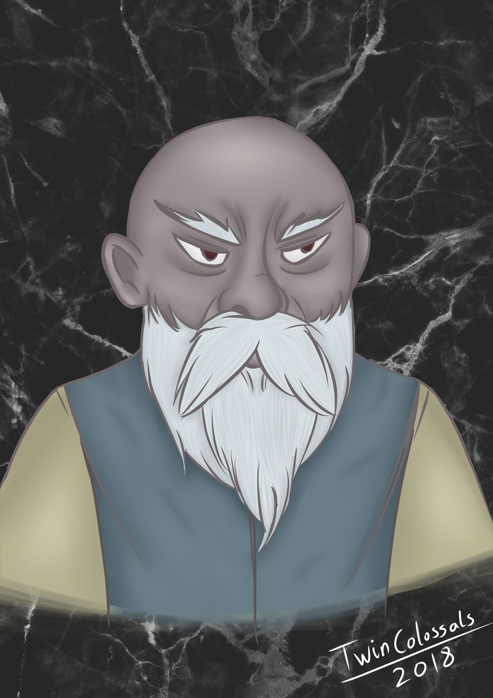

# Hemeth

Hemeth is a male duergar merchant from Gracklstugh, first met in Sloobludop.

## Personality
Hemeth's personality is not quite known, for he has been with the party for a short time.

## Background
Little is known about Hemeth's background. He mentioned to the party that he was a merchant who tried selling to both sides of the Sloobludop schism, but was eventually caught, which was likely how he ended up as a sacrifice.

## Story
Hemeth was first met in Sloobludop as a potential sacrifice to Leemooggoogoon at the cult of the Deep Father. He was chained to the altar and was beaten and nearly unconscious, but was just barely able to speak with the party when they spoke to him. He did not know where he was or what was going on. After Demogorgon rose from the Darklake, [Ebadius](../pcs/ebadius.md) attempted to pull Hemeth free from his chains, but [Alias](../pcs/alias.md) stepped in and picked the lock and they escaped. Sarith took Hemeth into the tunnels to escape and they eventually me up with the rest of the party.
