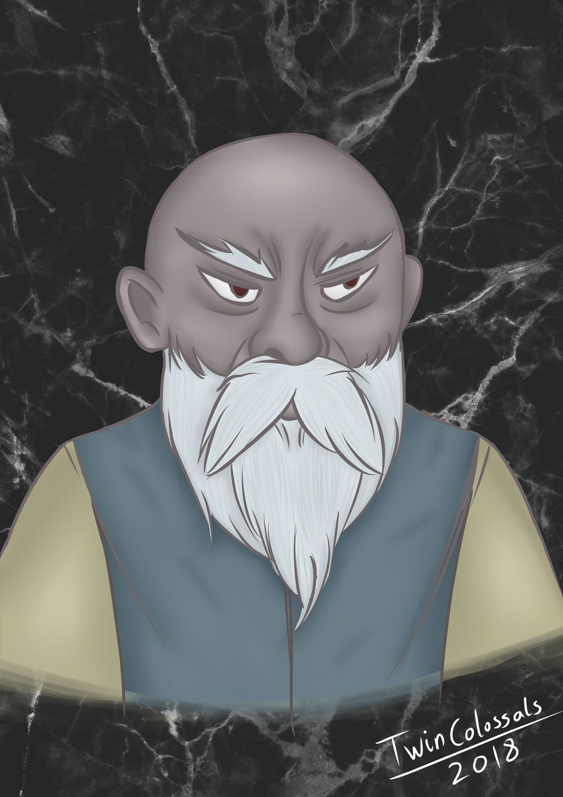

# Hemeth

[Home](../../README.md) > [Characters](../info.md) > Hemeth

Hemeth is a male duergar merchant from Gracklstugh, first met in Sloobludop. He was last seen in Gracklstugh after the party bribed him to leave them alone by giving him their boat.

## Personality
Hemeth is blunt and to the point, much like other grey dwarves. He does not use flair in his language and instead speaks and acts directly in order to get a job done. When presented with difficult decisions, he often prompts the party with the options available, rather than beating around about the possibilities.

He is extremely objective in his behavior, often throwing other decisions away (or even lives) in order to ensure the best course of action for himself or his close comrades. This was made clear several times, most notably when he spoke of removing [Shuushar](shuushar.md) from the group due to his lack of use, as well as removing [Sarith](sarith.md) when he was presented as a danger. This part of his personality has made nearly everyone upset with him, while Hemeth has described their behavior as "from the heart", which he seems to dislike.

## Background
Little is known about Hemeth's background. He mentioned to the party that he was a merchant who tried selling to both sides of the Sloobludop schism, but was eventually caught, which was likely how he ended up as a sacrifice. It is also known that he comes from Gracklstugh, and suggests that the party seek refuge there.

## Story
### [Travel to Sloobludop](../../sessions/arc02/info.md)
Hemeth was first met in Sloobludop as a potential sacrifice to [Leemooggoogoon](../../lore/demon_lords/demogorgon.md) at the [cult of the Deep Father](../../lore/organizations/deepfather.md). He was chained to the altar and was beaten and nearly unconscious, but was just barely able to speak with the party when they spoke to him. He did not know where he was or what was going on. After Demogorgon rose from the Darklake, [Ebadius](../pcs/ebadius.md) attempted to pull Hemeth free from his chains, but [Alias](../pcs/alias.md) stepped in and picked the lock and they escaped. Sarith took Hemeth into the tunnels to escape and they eventually met up with the rest of the party.

### [Dangers of the Darklake](../../sessions/arc03/info.md)
As the party went looking for food, Hemeth stayed behind at base camp with [Groggle](../pcs/groggle.md) and Shuushar while others looked for food. Eventually he was left alone with [Eldeth](eldeth.md) as others went to explore Sloobludop. When [Dad](../pcs/dad.md) and Sarith arrived and alerted them to the drow, they rushed off to Sloobludop to warn the others. Hemeth helped build their boat and was declared captain of the vessel, since he would know how to get to Gracklstugh.

While captaining the boat, Hemeth admitted to Alias that he had gotten them lost, but knew that he was headed in the direction of Gracklstugh. He brough this up in as blunt of a manner as possible.

When the boat was in danger, Hemeth did little to aid in the combat or the rowing, since he was navigating, and instead informed the party of the dangers and the possible solutions.

Hemeth went into the tunnels with Alias to find supplies when they encountered a group of quaggoths, which Hemeth noticed had fungi growing on their heads. Hemeth took Alias' dagger and returned to the boat where he alerted the party to the quaggoths and said that they didn't pay any attention to him. After the quaggoths tuned around, he waited with the party before returning for Alias with Ebadius, Groggle, and Dad.

As they departed, waiting for Shuushar, Hemeth stood his ground and refused to let go of his position as captain of the boat. After a heated back and forth, Hemeth remained captain and they sailed off.

Hemeth asked Alias on the trek if she was fit for travel, and if she wasn't he would restrain her.

During the combat with the duergar traders, Hemeth did little to nothing. He enlarged himself to appear threatening to the enemy, then commanded the boat to safety.

On several occassions, Hemeth asked party members why Shuushar is kept in the party. Both Eldeth and Groggle defended him when this was brought up.

Hemeth stayed behind with Groggle, Eldeth, Shuushar, and [Ront](ront.md) to defend the boat while the others went looking for food.

Hemeth was asleep when the party docked at the island, requiring Groggle to dock the boat. After the party had their encounter with the fungi, Hemeth ushered everyone onto the boat after seeing the large cloud of spores. When Sarith grabbed Groggle, Hemeth led a line of questioning to the party, heavily implying that he wanted Sarith removed from the party for the danger that he posed.

As the party debated dealing with Sarith, Hemeth demanded that he be removed from the boat. When Alias suggested a coup, Hemeth demanded Alias be grabbed immediately, in which Ebadius and Dad instead restrained Hemeth. While the party searched the tunnels nearby, Hemeth remained restrained on the boat and was kept under watch, first by Eldeth and later by Alias. He mentioned that he would not get in the party's way of traveling to Gracklstugh, since it would not be helpful for his own situation.

When pressed for information about Gracklstugh, Hemeth explained that the best method of entry is through the front gate, since this would be the least suspiscious action on their part. Both Dad and Sarith caught him in his lie, and Sarith explained that traveling to the docks would be best. Hemeth pretended to not know this, although the party remained unconvinced.

### [The City of Blades](../../sessions/arc04/info.md)
Hemeth remained bound while the party tried to make their way into Gracklstugh. After Alias' failed attempt to go in through the front entrance, the party asked Hemeth for assistance, to which he responded by saying he had no advantage to aid. After a dispute, Groggle was able to convince Hemeth to help by offering the boat to him after arrival. After Hemeth also got a promise that they would part ways, they agreed.

Hemeth concocted the plan to lead everyone to Gholbrorn's Lair without appearing suspicious. He borrowed a book from Dad to appear inconspicuous while pointing the others to the inn along the way. After Dad passed by, Hemeth returned the book to him and said "good fucking luck," then left. He has not been seen since.

## Relationships
Hemeth has mostly negative relationships with other party members. Ront has been the only party member that has not expressed any particular interest in Hemeth, while the other members have expressed some level of disdain. Alias and Ebadius have both appeared to act with care around Hemeth for fear of retaliation, as well as possibly assessing the situation in greater detail. On the other hand, Dad and Groggle have expressed extreme dislike for Hemeth, feeling as though his personality is more of a hinderence than an asset. 

## Trivia
* When Hemeth spoke up about where the party should travel, Dad interjected and mentioned that Hemeth shouldn't be listened to because he wasn't a member of the original party. This is made even stranger when Hemeth was made captian of their ship.
* Hemeth has been the sole reason that Groggle has shown any sort of aggression to another party member. After rudely speaking to Shuushar, Groggle stood up for him, saying "watch it, bucko."
