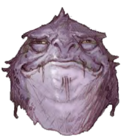

# Shuushar the Awakened

Shuushar is a male kuo-toa from Sloobludop first encountered in Velkenvelve.

## Personality
Shuushar may be best described as a pacifist and an optimist. He is never looking fro confrontation and always seeks a way to keep others in good spirits. This personality has lead to many issues throughout the adventure, as his attempt at good graces have often caused conflict with hostile opponents. He nevertheless tries to appease others and avoid violence whenever possible, which is difficult for him to do in the underdark.

His personality makes him quite agreeable at times, but others tend to heed the advice of more competent party members. For example, [Groggle](../pcs/groggle.md) has remained one of Shuushar's best companions, since the two of them are often of the mindset of trying to keep peace. His lack of desire for conflict, however, is also a rift that forms between himself as well as those that specialize in combat. This has caused numerous problems amonst party members, such as with [Ront](../party/ront.md) and [Hemeth](../party/hemeth.md), who often do not appreciate Shuushar's demeanor and approach to problem solving.

Even with others rejecting his ideas, Shuushar often keeps good spirits and views his party members as his friends, even if the feeling is not reciprocated.

## Background
Shuushar comes from the kuo-toa town of Sloobludop along the darklake in the underdark. His family, profession, or any other major lifestyle choices are largely unknown. While other kuo-toa are mostly insane, Shuushar stands out as an "enlightened" kuo-toa, aware of other cultures and not devout to the same gods. How he came to this position is also largely unknown.

It is known that Shuushar has some connections amongst important people in Sloobludop. He spoke with Ploopploopeen as if they had known each other for some time, and when exploring the town Shuushar spent time reconnecting with other kuo-toa that he knew. He was long ago known to be a follower of the sea mother Blibdoolpoolp, but has not expressed any devotion to gods during his time with the party.

## Story
### [The Prison at Velkenvelve](../../sessions/arc01/info.md)
Shuushar arrived at Velkenvelve together with [Stool](stool.md). While Stool hid in the corner, Shuushar swiftly introduced himself to the party, taking most note of [Alias](../pcs/alias.md) who spoke with him the most. He discussed how he was captured by drow while exploring outside of Sloobludop and how he is a pacifist, meaning that he did not resist capture. When discussing methods of escape, Shuushar often spoke like "good things would eventually happen", and had no real desire to fight back.

While planning an escape, Shuushar spent most of his time attempting to bond with the party, although many party members did not have much of a desire to speak with him. The one party member that he connected well with was Stool, who was also a pacifist, although that was mostly due to his age and fear.

When the prison break started, Shuushar was in the jail cell with most of the others. Led by [Ebadius](../pcs/ebadius.md) and Alias, Shuushar escaped with Groggle, [Jimjar](jimjar.md), Stool, [Topsy](topsy.md), and [Turvy](turvy.md) into the armory. While others fought, Shuushar helped Jimjar bar the back door. When Alias threw supplies down for others to use, Shuushar helped pass tools around, but did not take anything for himself. While combat ensued with [Ilvara](../velkenvelve/ilvara.md) and the demons, Shuushar stayed back as expected. Once many of the others left the armory, Shuushar jumped down from the armory and then into the pool of water beneath the waterfall, joined by Groggle, Jimjar, and Stool.

After escaping, Shuushar voted to travel to Sloobludop, since it was his hometown, he knew the route, and it was the closest location to them.

### [Travel to Sloobludop](../../sessions/arc02/info.md)
While it would ordinarily have been advantageous for Shuushar to remain in the middle of the pack for safety's sake, he helped lead the pack with Alias, since he knew the path to Sloobludop. With Alias scouting ahead, Shuushar guided the party into the large cavern that led to the lost city of Alversin. Once they arrived, Shuushar worked together with [Dad](../pcs/dad.md) and [Buppido](buppido.md) to look for supplies. Shuushar found the "rocktopus" and ran screaming down the road while Dad and Ront took care of it. 

Shuushar, together with Ebadius and Groggle, moved to investigate the central castle in Alversin. After encountering a few jarring events, Shuushar encouraged everyone to leave.

Whenever the party encountered enemies, Shuushar remained in the back of the pack while the others did the combat. This happened in several occassions on the way to Sloobludop, such as when encountering the goblins, fighting the grell, or defeating the collection of aggressive fungi in the fungus cavern. He was often positioned with Buppido and Stool, who also did little to nothing.

After Jimjar was found murdered, Shuushar was one of the few party members to keep themselves collected. He acted as though there must have been some sort of misunderstanding and vehemently defended himself, as well as those that he was close to, such as Groggle and Stool.

The evening after Ebadius let out the pressurized gas chamber, Shuushar spent the night on watch with Ebadius and Groggle. Together they discussed Sloobludop and what to expect on arrival, as well as the basics of culture within the city. He expressed how he could do much of the talking and the party could rely on him. When Sarith awoke in a fit of rage, Shuushar had little to say of the matter, but continued to treat Sarith as a friend and consistently expressed how they would find out whatever they needed to aid him.

After encountering the grell in the marsh cavern, Shuushar traveled with Buppido and Eldeth to forage for some supplies. Together they were able to come back with a few trinkets that the grell had collected, as well as some food.

When the party encountered an advancing group of kuo-toa, Shuushar moved to speak with them, but after Ebadius warned the party of their intentions he and Alias quickly pulled Shuushar back so he wouldn't cause the party grief. In private, Shuushar explained that he could give the party an introduction so make the transition smoother, and Alias agreed under the pretense of watching him from afar. When Shuushar went to speak with the kuo-toa, whatever he said caused them to attack him and carry him away back to the city. The party led in pursuit until they encountered another band of kuo-toa, where a fight began and Shuushar was freed.

After the combat, Shuushar introduced the party to Ploopploopeen, the high priest of the sea mother, and quickly spoke to say that he would help the schism of Sloobludop in any way he could. When they arrived in Sloobludop, Shuushar began visiting many people and traversing the city, leaving much of the party behind in the process. On one occasion, Groggle and Ebadius approached him to ask if any of the kuo-toa behaved oddly in their shops, to which Shuushar told them that kuo-toa do not have eyelids, and so they sleep with their eyes open.

Shuushar spent most of his time in Sloobludop, as far as the party is aware, conversing with Ploopploopeen about their plan to inflitrate the cult of the deep father. When Ploopploopeen would arrive to discuss plans, Shuushar was often in tow. When the time came to infiltrate the cult, Shuushar stayed back and let the others take care of the situation. Shuushar was able to withstand diving into madness from looking at Demogorgon. Shuushar was instructed to grab Ront, who was suffering from madness, and successfully got the two of them out of Sloobludop and into the tunnels.

## [Dangers of the Darklake](../../sessions/arc03/info.md)
After escaping, Shuushar helped establish a base camp together with Groggle and Hemeth. After others arrived with some food, he returned to Sloobludop with Ebadius, Groggle, and Alias to look for supplies. While searching the debris, it became clear that Shuushar had spiraled into a depression, and his party members attempted to comfort him in this process. He mentioned how everyone that he had ever known was gone and he didn't know what he was supposed to do with his life. The group with him convinced him to help them find supplies that might give them a chance for survival. Both during their travels in Sloobludop as well as on the darklake, party members, particularly Dad, informed Shuushar that they were his new family. This thought seemed to spark some new life in him.

When the party was attacked by the aquatic troll, Shuushar remained rowing the boat. When again attacked by darkmantles, Dad attempted to ecourage Shuushar to be more effective, which did nothing. A darkmantle found its way onto Shuushar's head and knocked him unconscious, but was saved by Groggle.

While traveling the darklake, Shuushar was able to find waterorbs for food on several occasions. The first time he was able to find waterorbs was when Alias ran back to the boat after encountering something worrying in the tunnels and was nearly left behind. There was a brief argument as to whether or not to leave him behind, but Shuushar arrived right as the decision needed to be made and was able to leave with them.

Shuushar stayed back and wondered why the party was fighting when encountering the duergar traders.

When docked at the tunnels, Shuushar stayed behind with many of the others while a scouting party looked for food. When the scouts returned back to alert of the enemies in the tunnels, Shuushar remained and looked for waterorbs.

As the party aproached the island on the darklake, Shuushar volunteered to explore the island himself. Ebadius cast *invisibility* on him to protect him and then ventured out onto the island. At some point, Shuushar encountered a tree with arms that identified him and grabbed him by the throat, causing him to let out a quick yelp before he began choking. The party arrived to rescue him; Dad cut off the arms and Groggle revived him before suffocating completely. He explained what happened and the party began investigating. After Ebadaius cast *thaumaturgy*, arms began erupting from the ground, and one successfully grabbed Shuushar by the leg and pulled him to the ground. When Dad again rescued him, Shuushar immediately ran back to the boat with Eldeth and Groggle.

After Sarith advanced on Groggle, Shuushar took the side of Groggle, saying that they would find a solution to his affliction soon. He effectively relayed the sentiment shared to him in Sloobludop that they were his family.

Shuushar did not take part in the mutiny to remove Hemeth as the captain, but did not seem opposed to the idea. After removing him, He supported haveing Alias and Groggle act as captains of the ship to ensure safe travel. When he was elected as the first-mate, Shuushar tried to refuse the position, and after Ebadius failed to convince him, Groggle was able to sway Shuushar into keeping this position. He was able to "steer" the boat away from some falling debris, to which Ebadius congratulated him.

When asked about Gracklstugh, Shuushar stated that he had not ever visited the city, but did think that the best approach would be to use the darklake for entry.

# Relationshuips
Over the course of the adventure, Shuushar has made a niche for himself as a friendly, yet somewhat useless party member. This position has caused him to gather a mix of relationships from bpositive to extremely negative. Groggle is one of Shuushar's biggest advocates, often encouraging him to cheer up or keep moving when things seem difficult. This is likely due to Groggle's positive personality in general and a connection that he may have to Shuushar's attempt at making friends. He also bonded strongly with Stool, since neither of them partook in violence, and Shuushar seemed sad when Stool disappeared. Other party members like Alias and Sarith have mostly positive opinions of Shuushar, but this mostly stems from the little use that he gives to the party.

Some party members like Ebadius, Eldeth, and Ront appear to have no real disposition toward Shuushar. While Shuushar speaks with everyone, others do not necessarily take kindly to his verbose attitude. The same relationship existed for Buppido and Jimjar when they traveled with the group.

Dad and Shuushar have a negative relationship, which is unsurprising given Dad's gruff and intense personality when compared to Shuushaar's pacifism. Dad has on several occasions tried to encourage Shuushar to step up and fight for the group, but this has done nothing to change Shuushar's mind. Most noteably, however, is the negative view Hemeth has of Shuushar. Due to his lack of aid to the party, Hemeth has on many occassions asked why Shuushar is in the party, actually leading Groggle standing up for him. Shuushar has not tried to fix these relationships other than being his usual self.

## Trivia
* The name Shuushar *the Awakened* comes from the fact that he believes that he is an enlightened kuo-toa, although many in the party believe him simply to be naive.
* Shuushar has been extremely unlucky throughout the adventure. For example, Shuushar was abducted by his own kind to be taken to Sloobludop, and was also attacked while invisible by a fungus tree in the darklake. While he has not been the most useful party members, many in the party do believe that he is unluckier than most.
* It became clear at some point that Shuushar was actually one of the wisest members of the party, which bothers many party members, considering the lack of aid he has given.
