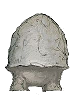

# Stool

[Home](../../README.md) > [Characters](../info.md) > Stool

Stool is a male mycanoid sprout, first encountered in Velkenvelve and last seen leaving after [Demogorgon](../../lore/demon_lords/demogorgon.md)'s arrival in Sloobludop.

## Personality
Stool is quiet and cowardly, mostly due to his age. He is often extremely scared of the events going on around him and is not particularly capable by himself. When first met in Velkenvelve, he said little and hid in a corner until someone calmed him down and convinced him that he would be okay. This has been a recurring theme with Stool, where he is not able to cope with the difficulties of the underdark and the party must calm him down.

While fearful, Stool is friendly to those who show kindness to him. [Alias](../pcs/alias.md) was the first person to attempt to speak with him in Velkenvelve, and as such Stool befriended Alias and stick with her at most times. Stool attempted to make friends with most party members during travel, but fear often got the best of him when party members were aggressive near him. As such, he has extreme fear of both [Dad](../pcs/dad.md) and [Ront](ront.md), the latter of which asked if Stool could be eaten.

Stool would try to assist the party in any way that he could, which was often difficult, as he had little to no physical capabilities. He offered his knowledge of fungi and the underdark whenever the situation would allow.

## Background
Stool comes from Neverlight Grove, the lesser known city of the mycanoids. He has revealed little about his friends or family from the area, simply stating that he had been abducted outside of his home. He has experience with a variety of flora and fauna in the underdark due to his history in Neverlight Grove, which has come in quite handy for the party. Anything beyond his home and knowledge is unknown.

## Story
### [The Prison at Velkenvelve](../../sessions/arc01/info.md)
Stool arrived at Velkenvelve together with [Shuushar](shuushar.md). While Shuushar introduced himself to the party, Stool instead cowered in the corner, afraid of the other cellmates. The first to speak with him was Alias, who asured him that she would protect him. Stool released his spores to better communicate with Alias. After this display, Alias brought everyone together to have Stool better communicate with everyone. He did also communiacte a bit with Shuushar, since they shared beliefs in nonviolence.

When [Sarith](sarith.md) started the riot outside the mess hall, Stool followed Alias, [Ebadius](../pcs/ebadius.md), and [Groggle](../pcs/groggle.md), together with [Jimjar](jimjar.md), Shuushar, [Topsy](topsy.md), and [Turvy.md](turvy.md), as they broke free of the cell and made their way into the armory. Stool mostly stayed in the middle of the pack, avoiding conflict wherever possible. In fear, Stool ended up following Groggle and Shuushar for most of the escape. He jumped into the water beneath them and avoided the slime in the pool.

When escaping, Stool voted to travel to Neverlight Grove in order to return home, and was supported by Dad and Sarith.

### [Travel to Sloobludop](../../sessions/arc02/info.md)
After escaping Velkenvelve, Stool stayed mostly in the center of the pack to avoid conflict. He spoke a bit with Jimjar during travel, who also stayed center pack, as well as with anyone else who was interested in the flora and fauna of the the underdark. Stool aided the party by identifying nearby resources and helped find food when times were tough.

When the party discovered the lost city of Alversin, Stool was placed in a scouting party with Alias and [Eldeth](eldeth.md). He mostly stayed by Alias' side until she gave instructions to search for supplies. Stool was able to find and identify a few different types of fungi while searching the city.

When a drow search party found the party, Stool was one of the party members spotted by the pursuers, although he was asleep at the time and did not know what was happening until others alerted him and kept him quiet.

While traversing the tunnels, Stool was eventually placed at the front of the party with Alias to scout for food. While most food was inedible or scarce, Stool was able to find a few fungi, such as barrelstalk, to make food with.

Stool mostly kept quiet when not searching for food and supplies, preferring to stay in the middle of the pack when possible. He mostly stuck with Alias, who asked for Stool to search for food, and Shuushar, who shared opinions with Stool regarding pacifism.

Stool was in an extreme panic after Jimjar was found dead, unsure as to who to trust, much like the others. He was identified by those keeping watch that he did not sleep through the night, likely due to anxiety.

When Shuushar was taken by the kuo-toa from Sloobludop, he expressed extreme concern, but made no action under fear.

Stool spent most of his time in Sloobludop keeping quiet and laying low in the tavern. He spent this time recovering and reveling in the safety of the town. When Demogorgon was summoned he suffered from some form of temporary insanity and an away screaming. This was the last anyone had seen of Stool.

## Relationships
Stool has good relationships with both Alias and Shuushar. His relationship with Alias began as the first connection he made while in Velkenvelve, established as a source of safety. Alias continued to be a good influence on Stool and assured him that things would be okay while continuing to protect him, much to his appreciation. His connection with Shuushar stemmed from their pacifism backgrounds. While not many others paid attention to it, Stool and Shuushar often conversed while traveling the tunnels. What they discussed is unknown.

No party members have a particularly negative opinions of Stool, except for thoughts about his usefulness in combat. His assistance in finding supplies made him a respected member of the party, even if he was unable to participate in combat. He did have a strained relationship with Ront, however, as he once asked if he was allowed to eat Stool. Because they were of the same race, a race he did not know of, this also made Stool's relationship with Dad difficult.

## Trivia
* During overworld travel, the players (and the dungeon master) would often forget about Stool, as he blended in with most of the backgrounds used.
* While Stool was able to find food to eat, he was unable to prepare any of it.
