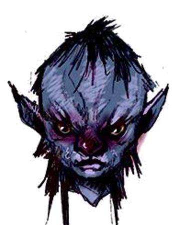

# Topsy

Topsy is a female deep gnome first encountered in Velkenvelve.

## Personality
Topsy is a bit mousy, speaking only a little bit at a time. She is more vocal than her brother [Turvy](turvy.md) and often spoke on his behalf. She keeps to herself, as if hiding something, and is very protective of her brother, keeping him close by.

## Background
Little is known of Topsy's background. She originally lived in Gracklstugh with her brother and arrived in Velkenvelve after being abducted by drow nearby.

## Story
### [The Prison at Velkenvelve](../../sessions/arc01/info.md)
Topsy arrived with her brother in Velkenvelve as the final batch of prisoners. She kept mostly to herself and conversed mostly with her brother Turvy while answering probing questions from other prisoners. She spoke a bit with [Alias](../pcs/alias.md) and [Ebadius](../pcs/ebadius.md), only revealing that they were scared and wanted to go home. She followed instructions of the other prisoners, since they held more sway than she did.

When the prison escape began, Topsy stayed in the back of the pack with Turvy, letting the others lead the way. She helped bar the door behind her to prevent drow and invading demons from attacking. She stood in the armory while the party prepared for combat when Ilvara cast a spell that knocked her into the webs. From there, Topsy was never seen again.

## Relationships
Topsy has her best relationship with her brother Turvy. She did a slight bit of conversing with Alias and Ebadius, but not enough to establish a real relationship with either of them. She did give [Jimjar](jimjar.md) an uneasy feeling, which he expressed to Ebadius and left him feeling uneasy with her.
