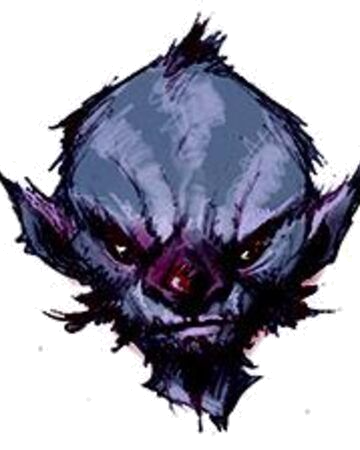

# Turvy

Topsy is a male deep gnome first encountered in Velkenvelve.

## Personality
Turvy is quite and reserved, seemingly afraid of others. He let his sister [Topsy](topsy.md) do any and all talking for him and only speaks when absolutely necessary. He keeps to himself, as if hiding something, and relies on his sister for guidance and instruction.

## Background
Little is known of Turvy's background. He originally lived in Gracklstugh with his sister and arrived in Velkenvelve after being abducted by drow nearby.

## Story
### [Welcome to Velkenvelve](../../sessions/arc01/info.md)
Turvy arrived with his sister in Velkenvelve as the final batch of prisoners. He kept entirely to himself and conversed only with his sister Topsy, making it unknown what he was discussing with her. He followed his sister around everywhere she went.

When the prison escape began, Turvy followed behind Topsy as they reached the armory. Together with his sister, they helped barricade the back door to prevent further drow and demon attack. He stood in the armory with the others until Ilvara cast a spell that knocked Topsy out of the room into the webs. Without hesitation, Turvy jumped into the webs after yelling for his sister and hasn't been seen since.

## Relationships
Turvy has his best relationship with his sister Topsy. Beyond discussions with Topsy, Turvy never had any conversations with other characters.
