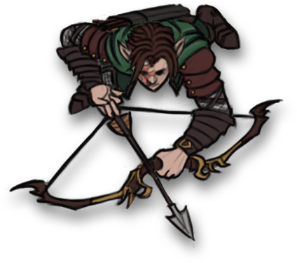

# Alias Fakename

Alias is an female elf rogue played by Mark.

| STR | DEX | CON | INT | WIS | CHA |
| --- | --- | --- | --- | --- | --- |
| 13 | 16 | 10 | 14 | 8 | 13 |

| Race | Class |
| --- | --- |
| Elf (Wood) | Rogue |

## Personality

Alias is a secretive and calculating person that is always looking for a new gambit to get what she wants. She doesn't completely detach herself from her companions, but she often sees her companions as a means to an end. As an example, Alias has a fairly good relationship with Eldeth, even so much as to say as she is trying to form a relationship, while her demeanor with [Dad](dad.md) is often a bit manipulative, boosting his ego to make sure that he will listen to her.

Alias is well organized and calculating, having no difficulties coming up with a plan or strategy. These strategies may be short term and simply be quick ploys, or may involve larger schemes, such as tricking her companions or searching for something lost to her.

## Background
Little is known about Alias and her background. She has used the name of someone in discussions with others, implying that there is someone she may know in the underdark, but she has not confided the truth in anyone.

## Story
### [The Prison at Velkenvelve](../../sessions/arc1/info.md)
Alias arrived at Velkenvelve in the second wave of prisoners, together with Dad and [Buppido](../party/buppido.md) and after the group of [Ebadius](ebadius.md), [Groggle](groggle.md), and Sarith. Her first interpretation of everyone was that she was surrounded by incompetent people and would need to organize the others to get out. He connected a bit with Sarith, who had the most information to give, and kept the others at a bit of a distance.

The prisoners were separated into two groups to perform menial chores to keep them busy. Alias was grouped with Groggle and Sarith and tasked with cleaning laundry at the waterfall. Alias found some rope tucked into a crevice when she heared yelling from the mess hall. Alias moved closer to the mess hall to see the cause and was thrown into a wall by [Ilvara](../velkenvelve/ilvara.md), who made her first appearance. Alias infiltrated the room she came from to find the statue of Lolth and tried to topple it, but was surprised to find another priestess and a giant spider. She and Groggle left and followed Sarith's advice to jump down to the webs.

In the webs, Alias, Groggle and Sarith eventually met up with Dad who had fallen from the ledge above. Worried about the slime beneath, Alias tried climbing the rock wall out until the guards came to retrieve them. They were escorted back to their cell, where they met with Eldeth and [Jimjar](../party/jimjar.md) and eventually of the prisoners. Alias quickly got Eldeth on her side and began courting her. 

Alias was also the only character who could speak with prince [Derendil](../party/derendil.md), who was an elf polymorphed into a quaggoth. While Derendil spoke of his heritage, Alias had no knowledge of his family or kingdom. She spoke with him and assured him that they would escape together.

When Sarith, Eldeth, and Dad started a commotion during their chores, Alias and Ebadius led the charge from the prison cell to escape. They entered the armory and while Ebadius held off the guards Alias climbed the ladder and began throwing weapons and armor down for the party. After the guards were incapacitated a swooping demon snapped the bridge, leaving a single thread of spider silk that Alias climbed across to reach the opposing ledge. Ilvara cast *hold person* on her, but lost concentration from the demons and Alias jumped down to the spider webs. She met up with Ebadius and Buppido and escaped with Dad on the elevator.

After their escape, Alias voted to travel to Sloobludop, which was the closest settlement to where they were.

### [Travel to Sloobludop](../../sessions/arc2/info.md)
Alias mostly led the party as a scout, providing reconnaissance while following traveling instructions from Shuushar. When the party encountered the large cavern of the lost city of Alversin, Alias and Eldeth scouted forward looking for an obvious way forward. While the party marched forward and Eldeth and Dad began to panic, Alias calmed them down and marched them on.

Alias spent most of her time in Alversin searching debris, finding some food and a few odds and ends. She eventually followed Ebadius when he claimed he saw someone outside the walls, but she was unable to find anything. She also helped walk the perimeter to search for supplies, and did one final search with Eldeth and [Stool](../party/stool.md) before moving out.

While Alias did not kill any of the goblins in the tunnel, she did appear to scare them and became worried that Eldeth would judge her for this action.

While on watch in the tunnels with Eldeth, Alias heard people moving through the tunnels. She tried to distract them, but unfortunately drew their attention. She and Eldeth eventually were able to sneak out with the others.

Later with Alias and Eldeth on watch, Eldeth found Jimjar murdered. Alias filled a vial with water and convinced the party that it was a truth serum and told the party to drink it. When no one confessed, Alias said that it must have been a weak dose and wasnt't enough to get everyone to speak the truth. She then told everyone to relax and get some sleep, waking up when Dad threatened Sarith, then again convinced everyone to sleep.

Alias discovered the agressive mushrooms in the fungus cavern and alerted everyone to their advanceent on the party. She led the party out of the cave while Ebadius destroyed the walls to release the water, releasing pressurized air as well.

In her travels to Sloobludop, Alias became increasingly suspicious of Sarith, who spoke to her and admitted that he had no interest in making friends any longer. She also became more suspicous of Buppido, who spoke very bluntly and didn't try to evade speaking of tough subjects. He also mentioned that he was suspicious of Ebadius, who was "too strong to be a sorcerer" and that he "has the means." On the next day of travel she bonded more with Shuushar and learned a bit more about kuo-toa culture in the process. After Sarith woke up in a fit of rage, Alias quickly handed off her rope to Dad who tied his hands up.

Alias was able to get one strike on the enemy grell the party encountered before Dad killed it, where she then helped cut up the grell for food.

While on watch, Alias spoke with Sarith for the first time in a while positively, where Sarith confessed that he was thankful that he was still trusted. She also spoke some more with Shuushar about Sloobldop and kuo-toan culture.

Alias found an advancing kuo-toa party while scouting, which began yelling. Ebadius listened to the party and told them to run, and Alias pulled Shuushar back as they escaped to a nearby cave. Alias and Sarith then follow close behind Shuushar with Ebadius behind them as Shuushar attempts to parlay with the kuo-toa, but he finds himself captured. Sarith convinces Alias to wait and follow the kuo-toa to Sloobludop, but plans change when she sees a new band of kuo-toa intercept them. She killed a kuo-toa guard with Sarith and rescues Shuushar, then ushered Shuushar to again parlay with the kuo-toa.

In Sloobludop, Alias took the opportunity to investigate his party members. She and Eldeth investigated the rooms of their party members to look for clues as to who might be the murderer amongst them, but were unable to find anything. She had also passed off much of her inventory to Ebadius and Groggle to sell to local stores and gave much of her money to Eldeth to buy supplies. Alias also, cleverly using thieves' cant, purchased thieves tools from a local merchant.

In the night, Alias followed Buppido as he went for a walk around town, but mostly concluded that "he was weird." 

While the rest of the party acted to infiltrate the cult of the Deep Father, Alias stayed behind and wanted from afar. When her party entered the altar, she moved behind the statue of Leemooggoogoon to attack. As the attack started, she tried to distract the kuo-tao by mimicking the Deep Father, but once Demogorgon arose from the water she swam through the water, broke [Hemeth](../party/hemeth.md) free, then escaped. Alias quickly looted the general store before escaping back into the tunnels. She was one of the last perty members to meet up in the Underdark, aside from Stool and Buppido, who were not found.

### [To Gracklstugh, then Neverlight Grove](../../sessions/arc03/info.md)
Alias was one of the party members, along with Ebadius, Groggle, and Shuushar, to return to Sloobludop after Demogorgon's release. She helped loot ruined buildings while the others searched for salvage for building a boat. When the others arrived and reported that the drow had found them, Alias kept watch while the others built the boat before departing. During the combat on the boat, Alias was severely injured by an aquatic troll, but was healed by Groggle so she could keep fighting. After the first boat docking, she scouted ahead and heard some noises in the cave. When she reported this to the party, they decided to keep traveling down the darklake.

Alias and Hemeth investigated the tunnels until they found a group of quaggoths that appeared to have mushrooms growing on their heads. Alias ventured further while Hemeth turned back to warn the others. Alias encountered several strange things, most notably a voice that said "You're going to wish you hadn't done that", that spoke after she took an axe from a skeleton, as well as a collection of whispering voices. She returned to the party and urgently moved everyone out.

Alias ended up arguing with Hemeth as to who would captain the ship, but backed down as things got heated.

During the battle with the duergar traders, Alias most notably attempted to jump to their boat but was unsuccessful, crashing into the water below and being rescued by Eldeth. Afterwards, Alias confronted Ebadius about his actions, raising tensions a bit.

Alias, together with Ebadius, managed to pull the green hag onto the boat, although Alias did not know it was a hag at the time. When confronted with the second hag, Alias went with Dad and Ront to confront her, and immediately identified her as a hag. She tied her up and let Dad and Ront take care of her.

Alias went with Dad, Ebadius, and Sarith to look for food. After Alias scouted ahead and found some gnolls, Sarith went back to defend the boat and Groggle joined the pack, and together they killed the first wave of gnolls. She then scouted ahead and found the remaining gnolls before returning to develop a plan of attack. She damaged the pack leader but sustained serious wounds and was forced to retreat. After the pack leader was killed, she took its longbow for herself and delivered its glaive to Dad.

When Shuushar investigated the island in the darklake, Alias was at the ready for anything bad to happen. When Shuushar let out a scream, Alias began running into the forest and was led by Dad to finding Shuushar. When arms started erupting from the ground, Alias had to pull Ebadius away from the commotion to get them all onto the boat.

While dealing with Sarith, Alias began hallucinating Buppido giving her advice. With the complication between Sarith's attack on Groggle and her hallucinations, Alias voiced that she was not okay and needed help.

## Relationships
Alias attempted to have a romantic relationship with Eldeth and had been courting her for much of their journey. Through this connection, Eldeth appears to listen to mish of what Alias has to say, also considering that Alias takes charge in the party. Eldeth expressed her desire to remain friends with Alias, and while she was disappointed, Alias remains friends with Eldeth to this day.

Alias was also one of the few party members to bond with Stool, and this connection appears to be one of the few that show compassion from Alias. She also has a strangely positive connection with Dad, which is mostly in order to manipulate Dad into doing acts that are useful for Alias, or more commonly for the party as a whole. Alias often boosts Dad's ego in order to convince him to do what Alias wishes, although unknown to her Dad is aware of this behavior. 

Alias has a rocky relationship with Hemeth, as the two of them have often worked well together in planning and strategizing, although they have often argued about what is fair and who is in command. Beyond that, Alias does not have many negative relationships with people, although this is possibly because of her keeping her distance from others and not bonding too much with the party. She doesn't speak much with others like Ront and spoke little to Buppido, and while Alias might not care for them their true feelings remain unknown.

## Trivia
* Alias is quite skilled in several primary skills, but is notorious amongst her party members for being unlucky, and she often struggles to do things she has been trained to do, such as throwing objects for a distraction or climbing rock faces.
* Eldeth had become aware at some point that Alias had an interest in her, and the two of them had to have a difficult conversation in which she turned Alias down.
* Alias had not seen Groggle perform any type of bardic ability for the first several days that they were together, and actually thought that Groggle was one of the more useless memebers of the party until she heard that Groggle had helped heal Ront previously.
