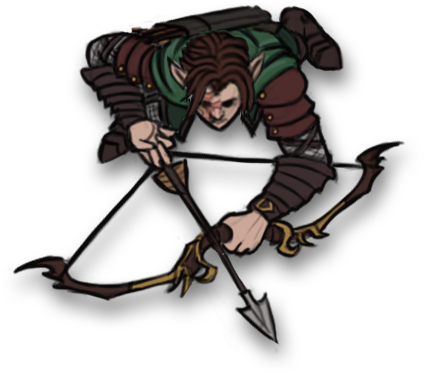

# Alias Fakename

Alias is an female elf rogue played by Mark.

| STR | DEX | CON | INT | WIS | CHA |
| --- | --- | --- | --- | --- | --- |
| 13 | 16 | 10 | 14 | 8 | 13 |

| Race | Class |
| --- | --- |
| Elf (Wood) | Rogue |

## Personality

Alias is a secretive and calculating person that is always looking for a new gambit to get what she wants. She doesn't completely detach herself from her companions, but she often sees her companions as a means to an end. As an example, Alias has a fairly good relationship with Eldeth, even so much as to say as she is trying to form a relationship, while her demeanor with [Dad](dad.md) is often a bit manipulative, boosting his ego to make sure that he will listen to her.

Alias is well organized and calculating, having no difficulties coming up with a plan or strategy. These strategies may be short term and simply be quick ploys, or may involve larger schemes, such as tricking her companions or searching for something lost to her.

## Story
### [The Prison at Velkenvelve](../../sessions/arc1/info.md)
Alias arrived at Velkenvelve in the second wave of prisoners, together with Dad and Buppido and after the group of [Ebadius](ebadius.md), Groggle, and Sarith. Her first interpretation of everyone was that she was surrounded by incompetent people and would need to organize the others to get out. He connected a bit with Sarith, who had the most information to give, and kept the others at a bit of a distance.

The prisoners were separated into two groups to perform menial chores to keep them busy. Alias was grouped with Groggle and Sarith and tasked with cleaning laundry at the waterfall. Alias found some rope tucked into a crevice when she heared yelling from the mess hall. Alias moved closer to the mess hall to see the cause and was thrown into a wall by Ilvara, who made her first appearance. Alias infiltrated the room she came from to find the statue of Lolth and tried to topple it, but was surprised to find another priestess and a giant spider. She and Groggle left and followed Sarith's advice to jump down to the webs.

In the webs, Alias, Groggle and Sarith eventually met up with Dad who had fallen from the ledge above. Worried about the slime beneath, Alias tried climbing the rock wall out until the guards came to retrieve them. They were escorted back to their cell, where they met with Eldeth and Jimjar and eventually of the prisoners. Alias quickly got Eldeth on her side and began courting her. 

When Sarith, Eldeth, and Dad started a commotion during their chores, Alias and Ebadius led the charge from the prison cell to escape. They entered the armory and while Ebadius held off the guards Alias climbed the ladder and began throwing weapons and armor down for the party. After the guards were incapacitated a swooping demon snapped the bridge, leaving a single thread of spider silk that Alias climbed across to reach the opposing ledge. Ilvara cast *hold person* on her, but lost concentration from the demons and Alias jumped down to the spider webs. She met up with Ebadius and Buppido and escaped with Dad on the elevator.

After their escape, Alias voted to travel to Sloobludop, which was the closest settlement to where they were.

### [Travel to Sloobludop](../../sessions/arc2/info.md)
Alias mostly led the party as a scout, providing reconnaissance while following traveling instructions from Shuushar. When the party encountered the large cavern of the lost city of Alversin, Alias and Eldeth scouted forward looking for an obvious way forward. While the party marched forward and Eldeth and Dad began to panic, Alias calmed them down and marched them on.

Alias spent most of her time in Alversin searching debris, finding some food and a few odds and ends. She eventually followed Ebadius when he claimed he saw someone outside the walls, but she was unable to find anything. She also helped walk the perimeter to search for supplies, and did one final search with Eldeth and Stool before moving out.

While Alias did not kill any of the goblins in the tunnel, she did appear to scare them and became worried that Eldeth would judge her for this action.

While on watch in the tunnels with Eldeth, Alias heard people moving through the tunnels. She tried to distract them, but unfortunately drew their attention. She and Eldeth eventually were able to sneak out with the others.

Later with Alias and Eldeth on watch, Eldeth found Jimjar murdered. Alias filled a vial with water and convinced the party that it was a truth serum and told the party to drink it. When no one confessed, Alias said that it must have been a weak dose and wasnt't enough to get everyone to speak the truth. She then told everyone to relax and get some sleep, waking up when Dad threatened Sarith, then again convinced everyone to sleep.

Alias discovered the mushrooms in the fungus cavern.

## Relationships
Alias has an affectionate relationship with Eldeth Feldrun and has been courting her for most of their journey. Eldeth appears to listen to Alias in most situations as Alias seems to take the most charge of the party. Alias is also one of the few party members to bond with Stool, and this connection appears to be one of the few that show compassion from Alias. She also has a strangely positive connection with Dad, which is mostly manipulative. Alias often boosts Dad's ego in order to convince him to do what Alias wishes.

Alias doe snot have many negative relationships with people, although this is possibly because of her keeping her distance and not bonding too much with others. She doesn't speak much with others like Ront or Buppido, and while Alias might not care for them their true feelings remain unknown.

## Trivia
* Alias is quite skilled in several primary skills, but is notorious amongst her party members for being unlucky, and she often struggles to do things she has been trained to do, such as throwing objects for a distraction or climbing rock faces.
