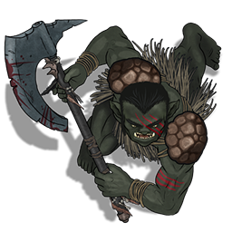

# Dad Father

Dad is a half-orc barbarian played by Allie. 

| STR | DEX | CON | INT | WIS | CHA |
| --- | --- | --- | --- | --- | --- |
| 16 | 12 | 15 | 6 | 14 | 10 |

| Race | Class |
| --- | --- |
| Half-Orc | Barbarian |

## Personality
Dad's personality is agressive and blunt. He is not very intelligent, so he often immedietely says what comes to his mind, which is often not the most eloquent phrase. As an example, Dad once intimidated one of his party members on watch to ask if he had killed somone, actually holding him in the air to get his answer.

Although his demeanor is tough, Dad is actually a person that strives for good. He seems somewhat resourceful and uses everything he has to his advantage. Throughout his time in the Underdark he has given his support for finding food and supplies, as well as fighting off some dangerous foes.

Dad is a bit arrogant, and his lack of intelligence lets this get to him at times. He often listens to the people that praise him, which leads to him following people that may or may not have any real respect for him.

## Background
Little is known about Dad and his background. He is surprisingly wise for an orc and makes a lot of "dad" jokes, leading to the possibility that he is actually a father and has a family somewhere.

## Story
### [The Prison at Velkenvelve](../../sessions/arc1/info.md)
Dad arrived at Velkenvelve in the second wave of prisoners, together with Ebadius and Buppido and after the group of Ebadius, Groggle Sixpetal, and Sarith Kzekarit. He immedietely was uncomfortable, not knowing who the others were and also not knowing what races everyone appeared to be. His suggestions for escape all tended to involve fighting, although not many other prisoners were up for these ideas.

Dad, Ebadius, and Buppido were simultaneously assigned to cleaning duty in the mess hall when Dad tried to steal a knife. He was caught by the drow and a fight broke out. Dad backflipped several times and struck the drow, injuring them, but was eventually injured so much by Ilvara that he was unable to continue fighting. While be escorted by the drow back to the jail cell Dad threw himself and his captor over the ledge into the lower spiderwebs. There her tried to escape to safety, fighting alongside Groggle and Alias, before he was eventually overcome and taken back to the cell.

Dad quickly befriended a new prisoner Ront, an orc from the surface. Together they tried to form a means of escape, but the drow gave them minimal tools and split them up, making it difficult to amount an escape.

Dad, Sarith, and another prisoner Eldeth were given a rock stacking chore when Sarith suddenly attacked a guardsman. Dad rallied Eldeth to fight and together they made it to the elevator after throwing two quaggoth over the edge. Dad also encouraged Ront and prisoner Derendil to fight the guard when several demons swooped in and caused more of a commotion. He brought his companions to safety and returned to grab the others. In the end Dad saved himself, Eldeth, Ront, Ebadius, Alias, Buppido, and Stool and met up with the others that had escaped.

When it came to leaving Velkevelve, Dad was vocal about traveling with Stool and Sarith to Neverlight Grove, but was outvoted as the partty voted for Sloobludop

### [Travel to Sloobludop](../../sessions/arc2/info.md)
Dad acted as one of the frontline warriors in the traveling party, due to his strength and constitution. His sanity began to waver as the party approach the lost city of Alversin. The whispers and scampering sounds eventually caused Dad to lose his mind briefly, but Alias calmed him down and he was able to proceed.

In Alversin, Dad searched a few streets together with Ront, Stool, and Shuushar. After Shuushar ran away screaming, Dad and Ront invstigated to find an octopus (dubbed the *rocktopus*) within the city, and Dad used his newfound axe to kill the octopus with Ront. Together they cut the meat of the octopus for travel.

When the party was awoken by the drow search party, Dad quickly stopped Ront from maing any noise, has he was prone to doing.

After Edleth found Jimjar dead, Dad suspected both Sarith and Buppido. During his watch with Sarith, Dad intimidated Sarith, causing him to get defensive, and after Dad threatened him and woke everyone up, the party began to suspect that Dad had something to do with Jimjar's death. He continued to suspect Sarith and Buppido but said nothing else of it.

## Relationships
Dad's best relationship is with his party member Ront, an orc that found his way into the Underdark and into the Velknevelve prison. They share a mutual bond of agression and often do whatever the other one is doing. Dad also has a strong relationship with Alias Fakename, although he is unaware that Alias is mostly manipulating him.

Other the other side, Dad has had a mixed relationship with Sarith Kzekarit, mostly stemming from a fear of a murderer in their party. Dad and Sarith once had a decent relationship, but ever since Dad felt threatened and confronted Sarith their relationship has suffered. Dad also is distrustful of Buppido, who he assumes has some sort of hidden agenda.

## Trivia
* Dad is particularly skilled at doing backflips, even with his hulking size. In his entire time in the Underdark he had injured several enemies with them and has never failed to do a backflip when trying.
* The first weapon Dad found in the Underdark he named "Dr. Lobotomy". Based on his level of intelligence, it is possible that he has had a lobotomy himself or knows someone who has had one.
