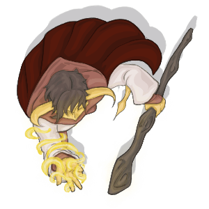

# Ebadius Cantos

Ebadius is a male tiefling sorcerer played by Nick.

| STR | DEX | CON | INT | WIS | CHA |
| --- | --- | --- | --- | --- | --- |
| 16 | 13 | 16 | 17 | 12 | 17 |

| Race | Class |
| --- | --- |
| Tiefling | Sorcerer |

## Personality
Ebadius is a charismatic man that tends to keep others at a distance while appearing friendly toward them. He is somewhat manipulative in the sense that he enjoys making those he does not like do silly or difficult things, such when he convinced [Jimjar](../party/jimjar.md) to run into the jail cell door.

Ebadius does not seem to have a sense of justice or virtue and often behaves only for himself and for his own ends. WHile he does work with others, he appears to have solely the agenda of getting himself out alive. This does not mean that he wishes ill of others, but it does appear that he sometimes views them as a means to an end and does not exactly bond with the other members of his party.

It is also possible that Ebadius is a bit fickle. He once referred to Buppido as "my buddy Buppido" soon after they met, but at some point became distrustful of him when he didn't offer much in the way of aid.

## Background
Little is known about Ebadius and his background. He is quite capable and strong for being a sorcerer, and this may be a consequence of his demonic heritage. His loner mentality may also be a consequence of this.

## Story
### [The Prison at Velkenvelve](../../sessions/arc1/info.md)
Ebadius was one of the first to arrive at Velkenvelve, together with [Groggle](groggle.md) and Sarith. He didn't do too much question of his companions, instead focusing on escape from prison. Ebadius tried casting magic in the cell and discovered that he was unable to. He performed menial chores together with Groggle and Sarith, including rock stacking.

After the arrival of new prisoners, Ebadius, [Dad](dad.md), and Buppido were tasked with cleaning in the mess hall. Ebadius pointed out a knife for Dad to take, which started a fight in the mess hall with the drow there. He and dad fought a few drow until Ilvara arrived and the two surrendered themselves. While being taken back through the commotion caused by [Alias](alias.md), Groggle, and Sarith, Ebadius tried to throw himself from the ledge down to the spiderwebs, but was unable to do so an claimed "sorry, I slipped," while Dad was successful. Ebadius and Buppido were returned to their cell.

At the cell Ebadius met Eldeth and Jimjar. Immedietly Ebadius convinced Jimjar to run into the cell door twice, causing him to dislocate his shoulder. Eventually Alias, Dad, Groggle, and Sarith were returned to the cell and they negan making their plan to escape. He primarily spoke with Sarith and Groggle regarding escape and did little to befriend other prisoners.

During a moment in which several prisoners were doing chores, Ebadius heard Sarith screaming from elsewhere in Velkenvelve. Seizing the opportunity, Ebadius was able to break down the door to the cell, and together with Alias helped lead Groggle, Shuushar, Jimjar, Stool, [Topsy](../party/topsy.md), and [Turvy](../party/turvy.md) out of the cell and into the armory. Ebadius fought off a few drow before getting hit with a *locust swarm* cast by Ilvara. Ebadius tried to destroy the bridge she stood on, but it was ultimately destroyed by passing demons in their attack. After Alias escaped on a spiderweb and Groggle failed to do so, Ebadius snuck past a perched demon and jumped to the lower webs. Together with Alias and Buppido they ran to the elevator where Dad brought them to safety.

At the end of the escape process, Ebadius voted to travel to Sloobludop, fearing that they needed to find shelter as quickly as possible.

### [Travel to Sloobludop](../../sessions/arc2/info.md)
While traveling to Sloobludop, Ebadius stood toward the back of the back of the pack to offer supporting services. He spent much of their travel time speaking with Sarith to learn more about the underdark and the horrors they would be encountering. While traveling to the lost city of Alversin, Ebadius tried sticking to the walls before giving up on the massive cavern.

In Alversin, Ebadius struck off on his own to search the outer perimeter when he discovered someone standing outside the city. He returned to the others and he, Alias, and Groggle went to search for the person. After being unable to find anyone, they took a walk around the city to search for remaining supplies, finding a few things and running into Dad and Ront who had just killed a *rocktopus*. Eventually he, Groggle, and Shuushar explored the entrance of the delapidated castle, but got scared by ominous noises and eventually left.

Ebadius helped kill the formerly enslaved goblins in the tunnel, while others questioned the need for it.

After Jimjar was found dead, Ebadius kept mostly to himself and said little about his suspiscions, although he began to wonder about Alias and Buppido, as well as Dad after he intimidated Sarith. He also investigated the body and the weapons everyone had, which then drew a rift between him and Sarith.

Ebadius helped strike down several aggressive fungi in the fungus caverns. He refilled part of his waterskin in the nearby water when he learned from Ront that it was likely poisoned. After everyone left the tunnel, Ebadius destroyed the cavern wall where the water was trickling out and let out a gust of warm wind that blew himself and others down the tunnel before escaping.

After a day's travel, Ebadius stayed on watch with Groggle and Shuushar. He asked Shuushar what Sloobludop was like and learned a bit about their culture in the process. In addition, Ebadius attempted to convince Shuushar that he was "from everywhere," but Shuushar was not convinced, although he did convince Shuushar that tieflings were good people. Afer another day's travel he, together with Groggle, Alias, and Buppido, went to investigate voices that they heard in a nearvy cavern but were unable to find an entrance. On his next watch me sat with Groggle and Buppido, and Ebadius succeeded in convincing Buppido that he was "from everywhere," but was unable to convince him that tieflings are good people. When Sarith woke up screaming, Ebadius tied his hands to keep him from hurting anyone.

Ebadius kept a close eye on Sarith after his outburst and was one of the people making decisions about his danger to the party. In the end, he and Alias deemed him calm and released him from his bindings, in which Sarith has proved himself since.

Ebadius stayed behind while Alias, Eldeth, Sarith, and Shuushar investigated the rogue kuo-toa party. When meeting Plooplooppeen, Ebadius attempted to follow custom to the best of his ability and treated the archpriest with much respect, which may be a consequence of his manipulative character.

In Sloobludop, Ebadius spent most of his time selling Alias' inventory with Groggle. He did most of the haggling and didn't buy anything of note for himself, although he took the liberty of skimming money off the top to give to himself and Groggle. He was also on the verge of stealing from the general store until he found the owner inside of a barrel.

When the party infiltrated the cult of the Deep Father, Ebadius was one of the first to act, casting a *scorching ray* on Blopplipodd for fear of being sacrificed. He also cast a *thunderwave* on several kuo-toa, but some of them turned out to be allies. He also tried to free [Hemeth](../party/hemeth.md) from his chains, but was not strong enough, relying on Alias' dexterity to pick the locks.

In the escape of Sloobludop, Ebadius teamed up with Groggle and returned to the inn to grab their belongings. They eventually met up with the group of Sarith, Hemeth, Dad, Eldeth, Shuushar, and Ront, after hearing Sarith's bell ringing in the tunnels.

## [???](../../sesssions/arc03/info.md)
Ebadius returned with Groggle, Alias, and Shuushar to Sloobdludop to look for supplies after the destruction by Demogorgon. He suggested to others that they should build a boat and traverse the darklake. During the combat while on the boat, Ebadius was extremely inaccurate and almost shot the boat with a *scorching ray*.

## Relationships
Ebadius has mixed relationships with most members of his party, with few people that dislike him and few that trust him. His best relationship is with Sarith Kzekarit, with whom he was first imprisoned in Velkenvelve. While he and Sarith shared few words with each other, Ebadius has often trusted Sarith's judgement and has listened to his counsel. Sarith once confided in Ebadius that he did not trust Buppido, a fact that he did not convey with any of the other PCs.

Ebadius himself is not trusting of Buppido, mainly due to the fact that he has caused many bad situations to get worse and has done little to aid the party. He also does not seem fond of Stool, who also acts as a burden to the party, but does listen to his knowledge of the underdark.

## Trivia
* No one has commented on Ebadius' appearence, except for Dad and Eldeth, which appears a bit strange considering the fact that he is a tiefling and is likely not lawful or good. Eldeth commented on his race since she does not like "those kinds of people," and Dad commented only to say he didn't know what he was.
* Ebadius' surname "Cantos" pays homage to the character "Stelio Kontos" from *American Dad*. If Ebadius has seen this show, then he must be from another plane of existence and has not yet stated this.
* Ebdaius was notoriously bad at the combat on the boat on the darklake. On several occasions he was worried that he would miss his *scorching rays* and hit the boat, but missed the boat as well.
