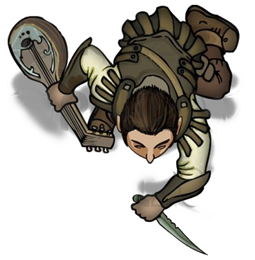

# Groggle Sixpetal

Groggle is a gnome bard played by Peter.

| STR | DEX | CON | INT | WIS | CHA |
| --- | --- | --- | --- | --- | --- |
| 10 | 15 | 10 | 11 | 14 | 18 |

| Race | Class |
| --- | --- |
| Gnome (Forest) | Bard |

## Personality
Groggle is an optimistic, friendly, and fairly quiet person. As expected of a bard he is quite musical and often tries to use music to spur the party's morale. He tries to use anything that he sees as a musical instrument, such as chamber pots or rocks. He is not necessarily outspoken and he will often go with the flow of his companions, but he makes sure that his ideas are heard enough to at least hold merit.

While a bit quiet, Groggle is indeed adventurous. For example, when exploring the lost city of Alversin with [Ebadius](ebadius.md) and Shuushar, the three of them explored a seemingly haunted castle and encountered several scary things before leaving. He also personally faced a giant spider in Velkenvelve, even when on its own webbing.

This courage could come from Groggle's resourcefulness. Groggle has made use of improvised weapons as well as maneuvering his way through tricky situations. For example, Groggle was able to calm an aggressive giant spider and ride it for a time. In addition, in a spectacular feat, Groggle was able to convince an enemy drow to turn away while looking for his party.

## Background
Groggle came from a small village somewhere on the surface in which had some form of a revolution. He admitted to participating in the revolution as well when questioned by others about whether or not killing was an acceptable act, where he further added that he learned methods of healing. It was during these difficult times that he learned his craft for medicine.

His musical skills imply that Groggle may have attended a bard's college somewhere, although it is unlikely that he would have attended it in his small village.

## Story
### [The Prison at Velkenvelve](../../sessions/arc1/info.md)
Groggle arrived at Velkenvelve with Ebadius and Sarith as the first set of prisoners. Groggle immedietely began making the best of a bad situation, trying to play music on chamber pots and making the food palletable. He began performing menial chores, such as stacking rocks. He asked one of the guards why he was stakcing rocks, and was slogged in the face.

Groggle was with [Alias](alias.md) and Sarith when a fight broke out in the mess hall. Groggle slowly followed behind Alias as they entered a room with a giant statue of Lolth, where the two of them briefly fought a priestess. After leaving he followed Sarith down into the spiderwebs where they encountered another giant spider, which Groggle was able to befriend and ride. From here Groggle was unable to do much until he was shot with a poisoned bolt and knocked unconscious. Groggle awoke in the prison cell when the guards arrived and used him as an example, beating him within an inch of his life.

When Sarith started a brawl outside, Groggle was in the prison cell when the party was able to break out. Led by Ebadius and Alias, Groggle escaped prison with Shuushar, [Stool](../party/stool.md), [Jimjar](../party/jimjar.md), [Topsy](../party/topsy.md), and [Turvy](../party/turvy.md). He stayed in the back and watched their backs as demons arrived and the guards scrambled. When he entered the armory he wast struck with a *locust swarm* spell from Ilvara and was knocked out. After he was resuscitated the party began to panic as a large demon perched itself on the armory. Groggle was one of the last to leave, jumping out of the armory and following Shuushar and Jimjar down into the water. The three escaped from the pool before the ooze caight them.

After meeting up with the party, Groggle voted to travel to Sloobludop, as it was the closest place.

### [Travel to Sloobludop](../../sessions/arc2/info.md)
As a caster, Groggle supported the party mostly from the back of the pack. He was farily silent during their trip, letting the others guide their way into the lost coty of Alversin. He helped search the buildings with everyone else, finding a few odds and ends, such as a bottle of wine. On the second day of exploration, Groggle, Ebadius, and Shuushar all investigated the central castle. Together they ecnountered some eerie noises and whispers and decided to leave without finding anything.

When the party encountered a group of formerly enslaved goblins, Groggle cast *bane* and shouted "we mean you no harm", to which his party decided to kill three of them and let a fourth one go.

Later that night as the drow caught up with them, Groggle cast *suggestion* and conviced the drow that they weren't there, rescuing the party. He then followed behind as they made their escape through the cave. He supplied the wine he had found and played music for his party as they fell asleep.

When Eldeth found Jimjar stabbed to death, Groggle mostly kept quiet and watched the reactions of others as people began pointing fingers. He never made his suspicions known if he had any, but he did ask a few questions of the group to indicate that he was trying to piece it all together. While he was unable to deterine anything, he did stay close to a few people, such as Sarith and Stool, who he supposedly still trusts.

Groggle mostly stayed back during the fight in the fungus cavern, steering clear of the spore clouds. After the clouds settled he went to the aid of Ront, who had inhaled a lot of the spores. After he drank the water anc claimed it tasted weird, Groggle used *lesser restoration* to pick him back up before exiting the cavern with everyone, led by Alias.

After traveling for a day Groggle was on watch with Ebadius and Shuushar. Shuushar revealed some dangerous facts about kuo-toan culture that made Groggle rethink (and possibly regret) his vote for Sloobludop. The next day of travel ended with Alias, Ebadius, Groggle, and Buppdio investigating some voices that they had heard from a nearvy cavern, unable to find anything. He also tried to heal the infection on Sarith's face, but it only seemed to burn him in the process. During his watch with Ebadius and [Buppido](../party/buppido.md) the party was awoken by a screaming Sarith, to which Groggle said little.

For much of the remaining travel to Sloobludop Groggle stayed quiet and deferred to Ebadius and Alias for decision making. He stayed somewhat back when encountering the rogue kuo-toa and joined up with Plooplooppeen when he arrived, citing that they needed a safe place to stay.

When in town, Groggle and Ebadius sold much of Alias' spoils together. They sold much to the curiosity shop and had other objects appraised, but his biggest achievement was the purchasing of a drum that sounded like a horn playing C# when struck. He used this instrument to do some street performances, but it did not work out, but he was successful in rallying the patrons of the inn using his drum and some "ham-bonin'". The next morning, Groggle purchased a few crossbow bolts for himself.

Unsure of who was an enemy and who was a friend, Groggle did little to aid the fight in the Altar of the Deep Father. Once Demogorgon revealed himself from the waters, Groggle was one of the few people who kept themselves together and commanded people to escape. He was the one calmed Eldeth down and convinced her to get Dad out of the altar.

When escaping Sloobludop, Groggle teamed up with Ebadius as they retrieved their belongings from the inn. He was able to signal to their party members that they were coming down the tunnels by using using magic drum and the two of them met up with Sarith, [Hemeth](../party/hemeth.md), Dad, Eldeth, Shuushar, and Ront.

### [To Gracklstugh, then Neverlight Grove](../../sessions/arc03/info.md)
Groggle joined up with Alias, Ebadius, and Shuushar to investigate the ruins of Sloobludop after Demogorgon's attack. He successfully found several parts of boat wreckage that could be salvaged to make a new boat for traversing the darklake. He helped assemble the boat before departing. While rowing, Groggle spent most of his efforts healing others fighting monsters and rowing the boat, but was unable to avoid damage.

While others rested or ventured into the tunnels, Groggle chose to aid in the repairs of the boat, but wasn't particularly helpful. He teamed up with Dad and Sarith who did most of the work.

Groggle mostly stayed out of the way during the combat with the duergar traders. He mentioned that he felt put off about the need for combat and would be considering this when making future decisions. He tried to help Sarith as they rescued Ront from the water before sailing away.

## Relationships
Groggle is widely accepted amongst his party members, although he does not appear to have strong connections with them. He often listens to Sarith for counsel but the two of them do not discuss much other that their immediate plans for escape and survival. He does divulge a bit of information with Ebadius at times, possibly because they arrived together at Velkenvelve. While he has not particularly bonded with either [Dad](dad.md) or Ront, Groggle has done a decent job keeping them calm and focused, commanding at least a bit of respect.

On the contrary, Groggle does not have many negative relationships with his party. Besides the fact that he had escaped Velkenvelve, Groggle did make enemies of the guards at the prison by speaking his mind and acting relaxed, even when times were tough. If there are any party members that he doesn't like, he has not made it apparent to the others.

## Trivia
* Groggle is a very good improvisationist, although he has shown confusion when completing tasks he did not expect would work. For example, after taming a giant spider, he audibly stated "now I don't know what to do."
* Groggle refers to all his musical ventures as "ham-bonin'", regardless of what instrument is being used.
* The purchasing for the drum in Sloobludop marked the first musical instrument Groggle had obtained the whole adventure. Unfortunately this instrument cost 50gp and has caused others to boo him for his efforts.
* Groggle singlehandedly found the parts necessary to construct a boat for traversing the darklake, despite his lack of knowledge of boats.
