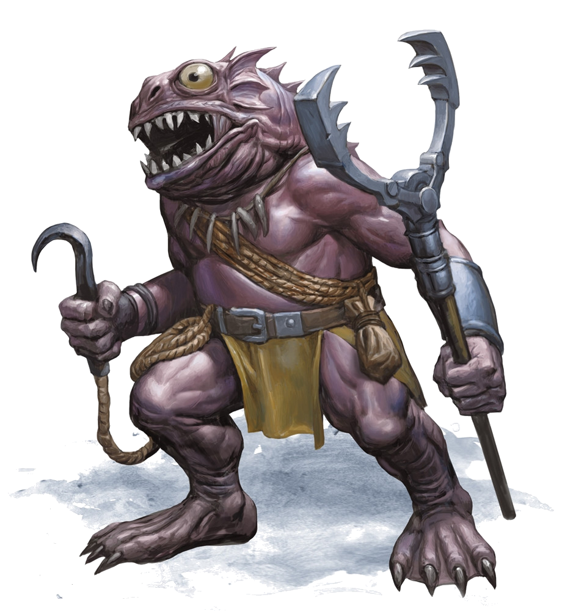

# Bloppblippodd

[Home](../../README.md) > [Characters](../info.md) > Bloppblippodd

Bloppblippodd was a female kuo-toa from Sloobludop and daughter of archpriest [Ploopploopeen](ploopploopeen.md) of the church of the Sea Mother. She served as the archpriest of the [cult of the Deep Father](../../lore/organizations/deepfather.md) until she was killed by a combination effort of [Ebadius](../pcs/ebadius.md) and Ploopploopeen at the altar of the [Deep Father](../../lore/demon_lords/demogorgon.md).

## Personality
Like many kuo-toa, Bloppblippodd behaves erratically and is extremely devout to her diety. She is arrogant and zealous, causing her to make rash decisions in the name of her god [Leemooggoogoon](../../lore/demon_lords/demogorgon.md). In this sense, she was willing to wage a religous war with her father over this and attempt to sacrifice outsiders to appease her god. Beyond the single interaction the party had with her at the altar of the Deep Father, not much is known about Bloppblippodd's personality.

## Background
Bloppblippodd is the daughter of Ploopploopeen and sister to Glooglugogg, who she was on bad terms with due to the schism in Sloobludop. A few weeks prior to the party's arrival in town, Bloppblippodd was given a vision of their new god the Deep Father, and with it an incredible increase in magical powers. This supported her claim that the Deep Father was thir religous figure and caused her to form the cult of the Deep Father, against her father the archpriest of the Sea Mother. Her relationship with her father and brother before the schism, however, is unclear.

## Story
### [Travel to Sloobludop](../../sessions/arc02/info.md)
Bloppblippodd was first seen at the altar of the Deep Father in Sloobludop when the party arrived to fake their sacrifice to the Deep Father. She graciously accepted their sacrifice and welcomed both the party abd Ploopploopeen to the altar of the Deep Father for the ritual.

Once the ritual began, Ebadius fired a *scorching ray* at her, fearing that they would run out of time to counterattack before the sacrifice was carried out. After his attack, Ploopploopeen struck her from behind and killed her on the spot.

## Death and Legacy
Bloppblippodd was killed by her father Ploopploopeen and Ebadius during the fake sacrifice. Her body disappeared in the chaos of the attack on Sloobludop, and it remains unclear what happened to her corpse.

Following her death, the Deep Father, now revealed as Demogorgon, was released into the underdark to throw the civilizations into chaos. Moreover, as seen by the party on return to the town, several kuo-toa remained that supported the Deep Father; her legacy remains in that the cult of the Deep Father, while mostly wiped out, persists in some select sects of kuo-toa culture.

## Relationships
Besides her poor relationship with her father Ploopploopeen and her brother Glooglugogg, not much is known about Bloppblippodd's relationships with others. 

## Trivia
* There is no relevant trivia regarding Bloppblippodd, since very little was seen of her throughout the adventure.
