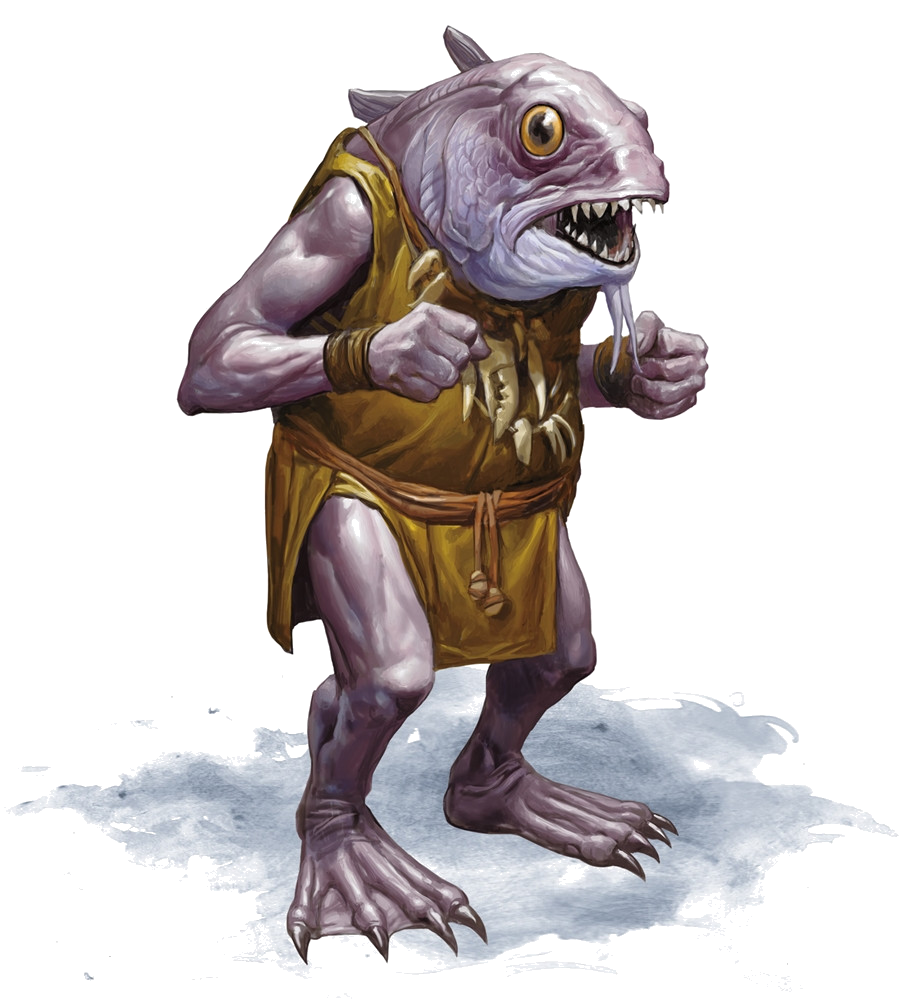

# Glooglugogg

[Home](../../README.md) > [Characters](../info.md) > Glooglugogg

Glooglugogg was a male kuo-toa from Sloobludop and son of [Ploopploopeen](ploopploopeen.md), the high priest of the church of the Sea Mother. He was last seen in the church of the Sea Mother before the destruction of Sloobludop and is presumed dead.

## Personality
Glooglugogg's personality is mostly unknown. He had minimal interactions with the party, with the primary interaction being his disdain for using outsiders to solve their problems. In that interaction, he had much of the personality of other kuo-toa, namely being erratic and a bit unpredictable.

## Background
Little is known about Glooglugogg's background. He is the son of the archpries of the Sea Mother Ploopploopeen, as well as the brother of [Bloppblippodd](bloppblippodd.md), the archpriest of the [cult of the Deep Father](../../lore/organizations/deepfather.md). It is unknown how Glooglugogg handled the schism between himself and his sister, but their relationship remained damaged.

## Story
### [Travel to Sloobludop](../../sessions/arc02/info.md)
Glooglugogg was first encountered by a few party members when they came to see the church of the Sea Mother. Glooglugogg expressed anger at the fact that Ploopploopeen was asking outsiders to deal with their problems in Sloobludop, but Ploopploopeen refused to listen and instead continued to work with the party. After this discussion, Glooglugogg seemed to ignore the party as they continued to plan their attack on the cult of the Deep Father.

## Possible Death and Legacy
After [Demogorgon](../../lore/demon_lords/demogorgon.md) attacked Sloobludop, Glooglugogg was not seen again by the party. As with most of the kuo-toa within Sloobludop, Glooglugogg was presumed to be killed. Since the only known survivors of the attack were Deep Father cultists, it is highly suspected that Glooglugogg did not survive the attack. He left little behind in the way of a legacy, as he mostly followed his father, who paved the way of the church.

## Relatonships
As a devout follower of the Sea Mother, Glooglugogg has a good relationship with his father Ploopploopeen, but was a bit at odds with him due to their differing opinions on how to deal with teh schism in Sloobludop. It is unclear what his relationship was with Bloppblippodd before the schism began, but their relationship ended in a negative tone on opposite sides of a religous war.

## Trivia
* There are no trivia points of note regarding Glooglugogg, since he had very few interactions with the party.
