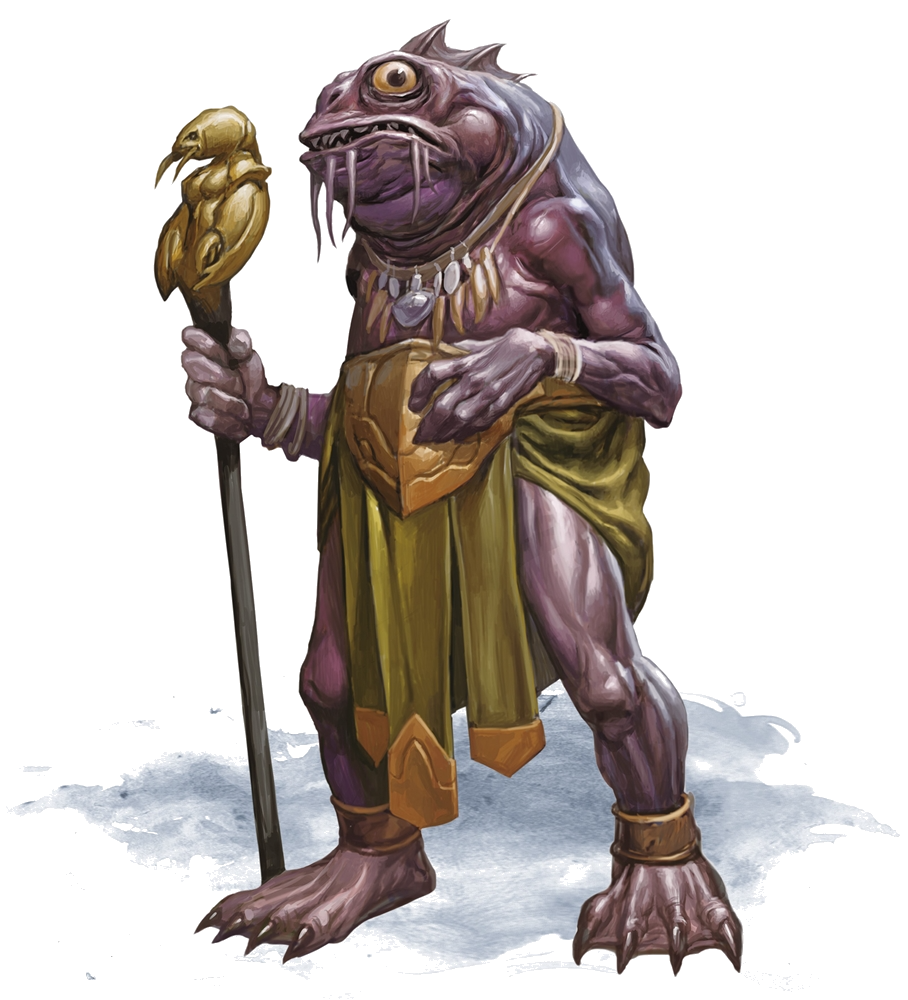

# Ploopploopeen

Ploopploopeen was a male kuo-toa first encountered outside the town of Sloobludop. He was the high priest of the church of the Sea Mother.

## Personality
As with most kuo-toa, Ploopploopeen has a personality that is a bit erratic and eccentric. Following kuo-toa customs, he has a strong desire to be standing above others while he is speaking, which proves difficult when speaking with larger creatures. He forces respect out of those he speaks with and enforces his position of power amongst his disciples, although not in a belittling way. He thinks very highly of himself overall.

Although a bit arrogant and self-centered, Ploopploopeen is caring for his people. He had expressed deep concern with how the schism between the church of the Sea Mother and cult of the Deep Father was affecting the people
