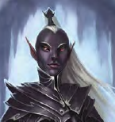

# Ilvara

Ilvara is a drow priestess and commander of the post of Velkenvelve. She was first encountered in Velkenvelve and was last seen traveling the tunnels searching for the party.

## Personality
Ilvara's personality is much like that of other drow: intimidating, blunt, and arrogant. She throws her strength around whenever she has the chance and she commands soldiers without consideration for their thoughts, let alone considering if they even like or respect her. She is physically powerful and throws here weight around whenever she can, which is often. She enjoys giving orders, especially yelling them loudly for all to hear.

She does not tolerate disobedience. She enjoyed punishing [Groggle](../pcs/groggle.md) after the first riot in Velkenvelve and beating him within an inch of his life. She has been seen yelling at her subordinates for various reason, mostly though consisting of questioning her orders, although it has often been difficult to hear her, both from her distance as well as the fact that she would dictate orders in undercommon. During combat, she has been seen commanding orders to everyone, but does not hesitate to join the fray herself, seemingly trusting in her own abilities and not worried for herself.

## Background
It is assumed that Ilvara comes from the drow capitol of Menzoberranzan, likely where the prisoners were to be taken after their time in Velkenvelve. As the leader of the post, it is likely that she comes from a prominant family of the drow, but her family name and status remain unknown.

## Story
### [The Prison at Velkenvelve](../../sessions/arc01/info.md)
Ilvara made her first appearance during the first riot at Velkenvelve when she emerged from one of the stalgtites, first seen by [Alias](../pcs/alias.md). She shoved Alias out of the way as she went to the mess hall to deal with the commotion caused by [Dad](../pcs/dad.md), [Ebadius](../pcs/ebadius.md), and [Buppido](../party/buppido.md). She subdued the rioters in the mess hall and commanded the guards to escrort them back to their cell. There she encountered the commotion being caused by Alias, Groggle, and [Sarith](../party/sarith.md). Rather than directly intervening, Ilvara kept distance and told the guards to wait and see what they would do. Once the party began harming the guards, she switfly ordered the party be captured.

Once the party was returned to the cell and given a chance to recuperate, Ilvara introduced herself to the party and proceded to have the party draw straws to see who would be punished for the riot. After Groggle lost, Ilvara proceded to beat him within an inch of his life, returned him to the cell, then left.

Once the larger riot began, Ilvara left her chamber again to greet the party, stopping them along the bridge between the armory and the wall. She had a brief standoff with Ebadius and fired a *locust swarm* into the armory, significantly damaging Groggle. When the demons arrived and joined the combat, the bridge Ilvara was standing on was destroyed and sent her crashing down into the webs. There she continued the combat with any that stepped in her way.

### [Travel to Sloobludop](../../sessions/arc02/info.md)
Ilvara began leading a search party to recover her prisoners. Her search party eventually caught up to the party, where some guards investigated the cave the party was hiding in while others investigated the goblins they had killed earlier that evening. Due to Groggle's *suggestion* spell, Ilvara did not notice the party and simply moved on to the goblins.

### [Dangers of the Darklake](../../sessions/arc03/info.md)
While Ilvara has not been seen, the drow search party continued to search for the party, finding them just outside of Sloobludop. It is assumed that she led the party into town to look for them.

## Relationships
Ilvara's relationships with other characters is mostly unknown, except for her direct relationships with her subordinates. It appears that many other guards fear her, and possibly for good reason.

## Trivia
* Groggle has received most of the brunt of Ilvara's wrath in the party. He was beatn after the first riot, as well as struck head on with a *locust swarm*.
