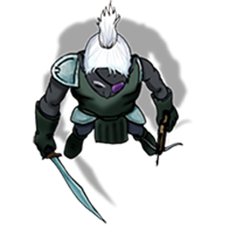

# ???

[Home](../../README.md) > [Characters](../info.md) > ???

??? is an unnamed male drow soldier that was first encountered in Velkenvelve.

## Personality
The personality and behavior of this drow is questionable. He has been seen to be a difficult and tough guard, although not quite as tough as others, such as [Ilvara](ilvara.md) and [the other unidentified male drow](shoor.md). His motivations are thrown even more into question when considering the fact that he provided food for the escaping party as they left Velkenvelve. Of the few drow encountered thus far, this soldier appears to be somewhat sympathetic, or simply calculating for something greater.

## Background
Nothing is known about this character's background. He does have disfiguring scars on his face, implying that he has been in some sort of accident.

## Story
### [The Prison at Velkenvelve](../../sessions/arc01/info.md)
The drow solider was one of the first drow encountered in the prison. He was tasked with bringing the first two batches of prisoners (consisting of [Ebadius](../pcs/ebadius.md), [Groggle](../pcs/groggle.md), and [Sarith](../party/sarith.md) for the first crew and [Alias](../party/alias.md), [Dad](../pcs/dad.md), and [Buppido](../party/buppido.md) for the second) into their cell. This drow is also the one that led the party out into the camp in order to perform their chores, although he was not the primary guard keeping watch.

When the first fight broke out in the mess hall, the drow soldier arrived with Ilvara to survey the situation. When conflict continued, he was tasked by Ilvara to retrieve the party that had escaped to the webs. He was also present for Groggle's punishment.

When the second riot started, the drow joined the fray in trying to fight off the attacking demons, although he swiftly disappeared into the fray. At some point, this drow met up with Sarith as Sarith escaped and escorted him to the lower tunnels to meet the party. He left a day's worth of food for the party before leaving. This was the last anyone had seen of this drow.

## Relationships
It is known that this drow has some connection with both Ilvara and the other unnamed drow, althought the depth of connection is not known. It appears that this drow had arguments with the other unnamed drow, although it is unknown what the arguments were about.

## Trivia
* Even though this drow delivered a large quantity of food for the party, since the party consisted of eleven members at the time the food only lasted them a single day.
