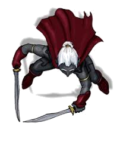

# ???

??? is an unnamed male drow soldier that was first encountered in Velkenvelve.

## Personality
This drow has been particularly aggressive, both towards the party as well as his fellow guards and followers. He appears to be a prominent leader amongst the drow of Velkenvelve, although remains subservient to [Ilvara](ilvara.md). In fact, he had been seen acting aggressively and shouting at [another male drow](jorlan.md) that appeared to have high status amongst the guards. Ultimately, he is ruthless and emjoys carrying out the cruel orders of Ilvara.

## Background
Nothing is known about this character's background. As a drow of status, it is likely that he has connections to a family within Menzoberanzzan.

## Story
### [The Prison at Velkenvelve](../../sessions/arc01/info.md)
The drow was first encountered during the first riot outside the mess hall at Velkenvelve. He arrived with a few guards to help escort the prisoners back to their cell. After [Alias](../pcs/alias.md), [Dad](../pcs/dad.md), [Groggle](../pcs/groggle.md), and [Sarith](../party/sarith.md) escaped into the webs, he watched with Ilvara as the party made their moves, and was instructed to retrieve them once they became threatening.

The drow later showed up in the second riot and initially ordered the guards to sieze the escapees, yelling instructions to all who could hear. He seemed to change his tune once the demons had arrived, instead focusing on the attacking demons and letting the party run free.

### [Travel to Sloobludop](../../arc02/info.md)
The drow was encountered again while leading a search party for the prisoners. He was seen ordering several guards to search the cave in which the party was hiding, while he moved deeper into the tunnels with Ilvara, seemingly to investigate the goblins they had killed. It was then the party escaped, and this drow was never seen again.

## Relationships
Little is known about this drow's relationships with the others he works with. He appears to have a positive relationship with Ilvara, implied only by the fact that the two of them have never been seen yelling at one another. He has a negative relationship, as far as anyone can tell, with the remainder of the drow of the post. He very much appears to use the "fear over love" tactic, and it appears to be working.

## Trivia
* There is no trivia about this character. Literally none. I was not able to come up with anything to say here. How pathetic.
