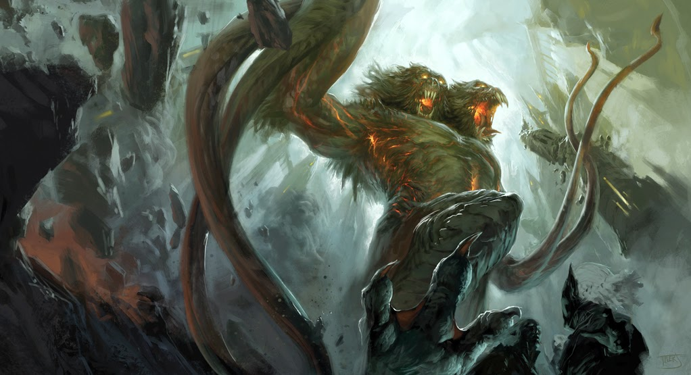

# Demogorgon

[Home](../../README.md) > [Lore](../info.md) > [Demon Lords](info.md) Demogorgon

Demogorgon is one of the Demon Lords of the Abyss. He goes by a variety of names in the literature of the Material Plane, including:

* Prince of Demons
* Siblant Beast
* Master of the Spiraling Depths

While demons as a whole do not have a sole leader, Demogorgon is often viewed as the lord of lords, being one of the most powerful and utterly terrifying demon lords known to mortals. His influence spreads through telepathy, making it difficult to determine if one's actions are true to themselves or simply a manifestation of the evil that Demogorgon spreads.

## Domains

Demogorgon is viewed as a true incarnate of evil, chaos, and destruction. His will is not fully understood, as it appears that his greatest goal for the Material Plane is to leave it utterly destroyed and to pull all viable souls into the Abyss with him. As such, his worshippers are often under the effects of this madness, often demonstrating extreme aggression and violence. 

## Story
### [Travel to Sloobludop](../../sessions/arc02/info.md)

Demogorgon appeared to the party under the guise of the [deep father](../organizations/deepfather.md) Leemogoogoon when he emerged from the darklake during a ritual. He proceeded to destroy the entire town, leaving those not affected by his madness or currently worshipping his visage to flee for their lives. Demogorgon did not hesitate and began destroying everything in sight. The party later returned to find not a scrap of building remaining in place.

## Navigation
* [Return to Top](../../README.md)
* [Return to Lore](../info.md)
* [Return to Demon Lords](info.md)
